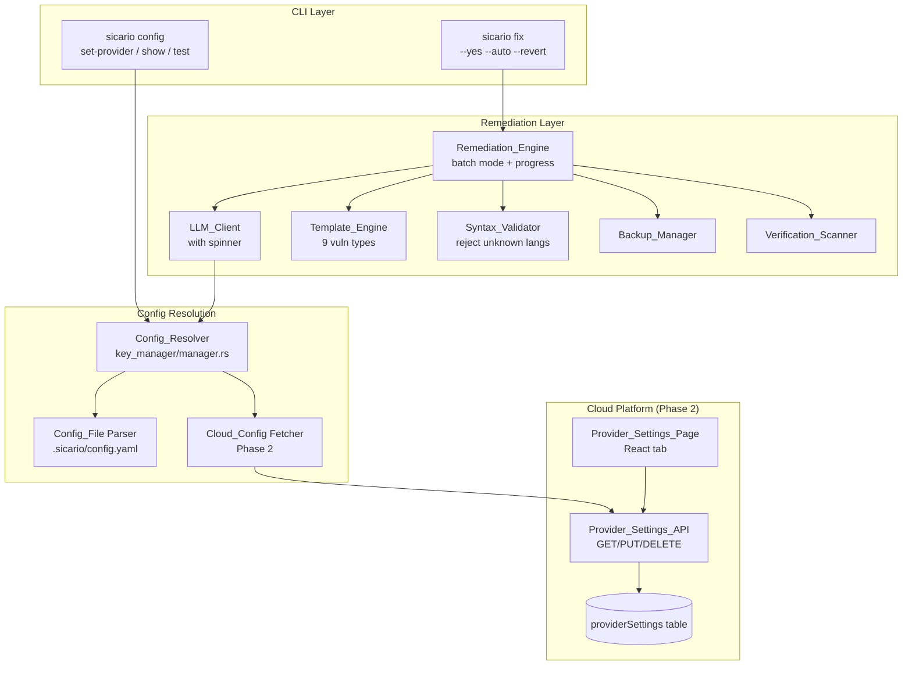

# Design Document: AI Fix Overhaul & Cloud-Synced Provider Settings

## Overview

This design overhauls the AI-powered code remediation system in Sicario CLI and adds cloud-synced provider settings. The work is split into two phases that share a unified configuration resolution architecture.

Phase 1 fixes local bugs and gaps: the Config_Resolver is extended to read `.sicario/config.yaml`, a terminal spinner is added during LLM calls, template fixes are expanded to 9 vulnerability types, syntax validation rejects unknown languages, batch mode is added via `--yes`/`--auto` flags, and the dead `CerebrasClient` re-export is removed.

Phase 2 adds cloud-synced provider settings: a `providerSettings` table in Convex, REST endpoints for CRUD, a new "Provider" tab in the dashboard Settings page, and CLI integration that extends the Resolution_Chain to include cloud config as the lowest-priority remote source.

## Architecture

### Resolution Chain (Unified)

```
┌─────────────────────────────────────────────────────────┐
│                   Resolution Chain                       │
│                                                         │
│  1. Environment Variables (highest priority)            │
│     SICARIO_LLM_ENDPOINT, SICARIO_LLM_MODEL,           │
│     SICARIO_LLM_API_KEY, OPENAI_*, CEREBRAS_*           │
│                                                         │
│  2. OS Keyring (API key only)                           │
│     keyring::Entry("sicario-cli", "llm-api-key")        │
│                                                         │
│  3. Local Config File                                   │
│     .sicario/config.yaml → endpoint, model, key         │
│                                                         │
│  4. Cloud Config (Phase 2, authenticated only)          │
│     GET /api/v1/provider-settings → endpoint, model,    │
│     decrypted API key                                   │
│                                                         │
│  5. Defaults (lowest priority)                          │
│     endpoint: https://api.openai.com/v1/chat/completions│
│     model: gpt-4o-mini                                  │
└─────────────────────────────────────────────────────────┘
```

### System Component Diagram



## Components and Interfaces

### 1. Config File Parser (`key_manager/config_file.rs` — NEW)

Parses `.sicario/config.yaml` for provider settings. Separated from `manager.rs` for testability.

```rust
use serde::{Deserialize, Serialize};

#[derive(Debug, Clone, Default, Serialize, Deserialize, PartialEq)]
pub struct LocalConfig {
    pub endpoint: Option<String>,
    pub model: Option<String>,
    pub key: Option<String>,
    // Unknown fields are silently ignored via #[serde(flatten)]
    #[serde(flatten)]
    pub extra: std::collections::HashMap<String, serde_yaml::Value>,
}

/// Load config from `.sicario/config.yaml`. Returns `None` if file
/// doesn't exist or is unreadable.
pub fn load_config_file(project_root: &Path) -> Option<LocalConfig> {
    let path = project_root.join(".sicario").join("config.yaml");
    let content = std::fs::read_to_string(&path).ok()?;
    serde_yaml::from_str(&content).ok()
}

/// Write config to `.sicario/config.yaml`.
pub fn save_config_file(project_root: &Path, config: &LocalConfig) -> Result<()> {
    let path = project_root.join(".sicario").join("config.yaml");
    let yaml = serde_yaml::to_string(config)?;
    std::fs::write(&path, yaml)?;
    Ok(())
}
```

### 2. Extended Config Resolver (`key_manager/manager.rs` — MODIFIED)

The existing `resolve_endpoint()`, `resolve_model()`, and `resolve_api_key()` functions are extended to check the Config_File after env vars. A new `ResolvedConfig` struct tracks the source of each value.

```rust
#[derive(Debug, Clone, PartialEq, Eq)]
pub enum ConfigSource {
    EnvVar(String),    // name of the env var
    Keyring,
    ConfigFile,
    CloudConfig,       // Phase 2
    Default,
}

#[derive(Debug, Clone)]
pub struct ResolvedValue {
    pub value: String,
    pub source: ConfigSource,
}

/// Resolve endpoint with full chain.
pub fn resolve_endpoint_with_source() -> ResolvedValue { ... }

/// Resolve model with full chain.
pub fn resolve_model_with_source() -> ResolvedValue { ... }
```

Resolution order for endpoint:
1. `SICARIO_LLM_ENDPOINT` env var
2. `OPENAI_BASE_URL` env var
3. `CEREBRAS_ENDPOINT` env var
4. `.sicario/config.yaml` → `endpoint` field
5. Cloud config (Phase 2, if authenticated)
6. Default: `https://api.openai.com/v1/chat/completions`

Resolution order for model:
1. `SICARIO_LLM_MODEL` env var
2. `CEREBRAS_MODEL` env var
3. `.sicario/config.yaml` → `model` field
4. Cloud config (Phase 2, if authenticated)
5. Default: `gpt-4o-mini`

Resolution order for API key:
1. `SICARIO_LLM_API_KEY` env var
2. OS keyring
3. `OPENAI_API_KEY` env var
4. `CEREBRAS_API_KEY` env var
5. `.sicario/config.yaml` → `key` field
6. Cloud config decrypted key (Phase 2, if authenticated)

### 3. Progress Indicator (`remediation/progress.rs` — NEW)

Uses `indicatif` (already a dependency) to show a spinner during LLM calls.

```rust
use indicatif::{ProgressBar, ProgressStyle};

pub struct LlmProgressSpinner {
    bar: ProgressBar,
}

impl LlmProgressSpinner {
    pub fn start(message: &str) -> Self {
        let bar = ProgressBar::new_spinner();
        bar.set_style(
            ProgressStyle::default_spinner()
                .template("{spinner:.cyan} {msg}")
                .unwrap()
        );
        bar.set_message(message.to_string());
        bar.enable_steady_tick(std::time::Duration::from_millis(80));
        Self { bar }
    }

    pub fn finish_success(&self, message: &str) {
        self.bar.finish_with_message(format!("✓ {}", message));
    }

    pub fn finish_error(&self, message: &str) {
        self.bar.finish_with_message(format!("✗ {}", message));
    }

    pub fn finish_timeout(&self) {
        self.bar.finish_with_message("✗ LLM request timed out — using template fix");
    }
}
```

The spinner is started in `RemediationEngine::generate_fixed_content()` before the async LLM call and stopped when the call completes or fails.

### 4. Expanded Template Engine (`remediation/templates.rs` — NEW)

Extracted from `remediation_engine.rs` into a dedicated module for maintainability. Adds 6 new vulnerability type handlers.

```rust
#[derive(Debug, Clone, Copy, PartialEq, Eq)]
pub enum VulnType {
    SqlInjection,       // CWE-89  (existing)
    Xss,                // CWE-79  (existing)
    CommandInjection,   // CWE-78  (existing)
    PathTraversal,      // CWE-22  (new)
    Ssrf,               // CWE-918 (new)
    InsecureDeserial,   // CWE-502 (new)
    HardcodedCreds,     // CWE-798 (new)
    OpenRedirect,       // CWE-601 (new)
    Xxe,                // CWE-611 (new)
    Unknown,
}

pub fn classify_vulnerability(vuln: &Vulnerability) -> VulnType { ... }
pub fn apply_template_fix(original: &str, vuln: &Vulnerability) -> String { ... }
```

Each new template follows the same pattern as existing ones: detect the language, find the vulnerable line, replace with an idiomatic safe alternative. The `Unknown` variant inserts a warning comment (never returns original unchanged).

Template fix strategies per new type:
- **Path Traversal (CWE-22)**: Canonicalize path, validate against base directory. Python: `os.path.realpath` + `startswith`. JS: `path.resolve` + prefix check. Rust: `canonicalize` + `starts_with`.
- **SSRF (CWE-918)**: Validate URL host against allowlist. Python: `urllib.parse.urlparse` + host check. JS: `new URL()` + host check.
- **Insecure Deserialization (CWE-502)**: Replace unsafe deserializer. Python: `yaml.safe_load` instead of `yaml.load`, `json.loads` instead of `pickle.loads`. JS: add schema validation after `JSON.parse`.
- **Hardcoded Credentials (CWE-798)**: Replace literal with `std::env::var()` / `os.environ.get()` / `process.env`.
- **Open Redirect (CWE-601)**: Validate redirect URL against allowlist of permitted domains.
- **XXE (CWE-611)**: Disable external entities. Python: `defusedxml`. Java: `setFeature(XMLConstants.FEATURE_SECURE_PROCESSING, true)`. JS: `libxmljs` with `noent: false`.

### 5. Strict Syntax Validator (`remediation/remediation_engine.rs` — MODIFIED)

The `validate_syntax` method is changed to return `false` for unknown languages instead of `true`.

```rust
pub fn validate_syntax(&self, code: &str, language: &str) -> bool {
    use crate::parser::Language;

    let lang = match language.to_lowercase().as_str() {
        "javascript" | "js" => Language::JavaScript,
        "typescript" | "ts" => Language::TypeScript,
        "python" | "py" => Language::Python,
        "rust" | "rs" => Language::Rust,
        "go" => Language::Go,
        "java" => Language::Java,
        "ruby" | "rb" => Language::Ruby,     // NEW
        "php" => Language::Php,               // NEW
        _ => {
            eprintln!("sicario: warning — no syntax validator for {language}, rejecting LLM output");
            return false;  // CHANGED: was `return true`
        }
    };

    match self.tree_sitter.parse_source(code, lang) {
        Ok(tree) => !tree.root_node().has_error(),
        Err(_) => false,
    }
}
```

Ruby and PHP support requires adding `tree-sitter-ruby` and `tree-sitter-php` to `Cargo.toml` and extending the `Language` enum in `parser/mod.rs`.

### 6. Batch Mode (`remediation/remediation_engine.rs` — MODIFIED)

A new `BatchResult` struct and `generate_and_apply_batch` method are added.

```rust
#[derive(Debug, Clone)]
pub struct BatchResult {
    pub applied: usize,
    pub reverted: usize,
    pub skipped: usize,
    pub details: Vec<BatchFixDetail>,
}

#[derive(Debug, Clone)]
pub struct BatchFixDetail {
    pub rule_id: String,
    pub file_path: PathBuf,
    pub outcome: BatchFixOutcome,
}

#[derive(Debug, Clone)]
pub enum BatchFixOutcome {
    Applied,
    Reverted(String),  // reason
    Skipped(String),    // reason
}

impl RemediationEngine {
    pub fn generate_and_apply_batch(
        &self,
        vulns: &[&Vulnerability],
        auto_confirm: bool,
        no_verify: bool,
    ) -> Result<BatchResult> { ... }
}
```

The `cmd_fix` handler in `main.rs` is updated to accept `--yes` and `--auto` flags (both map to `auto_confirm: true`). When active, fixes are applied without the `display_diff_and_confirm` prompt.

### 7. Cloud Provider Settings — Convex Schema (Phase 2)

New table added to `convex/convex/schema.ts`:

```typescript
providerSettings: defineTable({
    userId: v.string(),
    providerName: v.string(),       // "openai", "cerebras", "groq", "ollama", etc.
    endpoint: v.string(),
    model: v.string(),
    encryptedApiKey: v.optional(v.string()),
    createdAt: v.string(),
    updatedAt: v.string(),
})
    .index("by_userId", ["userId"]),
```

### 8. Cloud Provider Settings — API Endpoints (Phase 2)

Three new HTTP routes in `convex/convex/http.ts`:

- `GET /api/v1/provider-settings` — Returns `{ provider_name, endpoint, model, has_api_key }` for the authenticated user. Never returns the raw key.
- `PUT /api/v1/provider-settings` — Creates or updates. Accepts `{ provider_name, endpoint, model, api_key? }`. Encrypts `api_key` before storage.
- `DELETE /api/v1/provider-settings` — Removes the user's provider settings.

A new Convex mutation/query module `convex/convex/providerSettings.ts` handles the database operations.

API key encryption uses AES-256-GCM with a server-side secret stored in Convex environment variables (`PROVIDER_KEY_ENCRYPTION_SECRET`). The encrypted value is stored as a base64 string.

A separate authenticated endpoint `GET /api/v1/provider-settings/key` returns the decrypted API key — this is only called by the CLI, never by the frontend.

### 9. Cloud Provider Settings — Dashboard UI (Phase 2)

A new `ProviderTab` component is added to `SettingsPage.tsx` and registered in the `TAB_DEFS` array.

```typescript
const PROVIDER_PRESETS: Record<string, { endpoint: string; model: string }> = {
    openai: { endpoint: "https://api.openai.com/v1/chat/completions", model: "gpt-4o-mini" },
    cerebras: { endpoint: "https://api.cerebras.ai/v1/chat/completions", model: "llama3.1-8b" },
    groq: { endpoint: "https://api.groq.com/openai/v1/chat/completions", model: "llama-3.1-70b-versatile" },
    ollama: { endpoint: "http://localhost:11434/v1/chat/completions", model: "llama3.1" },
    openrouter: { endpoint: "https://openrouter.ai/api/v1/chat/completions", model: "meta-llama/llama-3.1-8b-instruct" },
};
```

The tab includes: provider dropdown, endpoint input, model input, masked API key input with reveal toggle, "Test Connection" button, "Save" button, "Delete Settings" button.

### 10. Cloud Config Fetcher — CLI Integration (Phase 2)

A new module `key_manager/cloud_config.rs` fetches provider settings from the cloud API.

```rust
pub struct CloudConfigFetcher {
    base_url: String,
    token: String,
}

impl CloudConfigFetcher {
    pub fn new(base_url: &str, token: &str) -> Self { ... }

    /// Fetch provider settings. Returns None if not configured or on error.
    pub fn fetch_settings(&self) -> Option<CloudProviderSettings> { ... }

    /// Fetch the decrypted API key. Returns None if not stored or on error.
    pub fn fetch_api_key(&self) -> Option<String> { ... }
}

#[derive(Debug, Clone, Deserialize)]
pub struct CloudProviderSettings {
    pub provider_name: String,
    pub endpoint: String,
    pub model: String,
    pub has_api_key: bool,
}
```

The fetcher uses `reqwest::blocking::Client` with a 5-second timeout. On any error (network, auth, parse), it returns `None` and logs a warning — never blocks the fix workflow.

## Data Models

### LocalConfig (Config File)

```rust
#[derive(Debug, Clone, Default, Serialize, Deserialize, PartialEq)]
pub struct LocalConfig {
    pub endpoint: Option<String>,
    pub model: Option<String>,
    pub key: Option<String>,
    #[serde(flatten)]
    pub extra: HashMap<String, serde_yaml::Value>,
}
```

### BatchResult

```rust
#[derive(Debug, Clone)]
pub struct BatchResult {
    pub applied: usize,
    pub reverted: usize,
    pub skipped: usize,
    pub details: Vec<BatchFixDetail>,
}
```

### CloudProviderSettings (Convex)

```typescript
{
    userId: string,
    providerName: string,
    endpoint: string,
    model: string,
    encryptedApiKey?: string,
    createdAt: string,
    updatedAt: string,
}
```

### FixArgs (Extended)

```rust
#[derive(Parser)]
pub struct FixArgs {
    pub file: String,
    #[arg(long)]
    pub rule: Option<String>,
    #[arg(long)]
    pub revert: Option<String>,
    #[arg(long)]
    pub no_verify: bool,
    #[arg(long, alias = "auto")]   // NEW
    pub yes: bool,
}
```

## Correctness Properties

### Property 1: Config Resolution Chain Precedence

*For any* combination of environment variable values (present or absent), Config_File values (present, absent, or file missing), Cloud_Config values (present, absent, or unauthenticated), and defaults, the Config_Resolver SHALL return the value from the highest-priority source that has a non-empty value. The priority order is: env var > keyring (key only) > Config_File > Cloud_Config > default.

**Validates: Requirements 1.1, 1.2, 1.3, 1.5, 9.1, 9.2, 9.3, 9.8**

### Property 2: Config File Round-Trip

*For any* valid `LocalConfig` struct with arbitrary endpoint, model, and key values, serializing to YAML via `save_config_file` and then parsing back via `load_config_file` SHALL produce an equivalent `LocalConfig` (endpoint, model, and key fields match).

**Validates: Requirements 1.7, 10.3**

### Property 3: Template Fix Differs From Original

*For any* source code string and *for any* vulnerability with a supported CWE ID (89, 79, 78, 22, 918, 502, 798, 601, 611), the Template_Engine SHALL produce output that is not byte-equal to the input.

**Validates: Requirements 3.7**

### Property 4: Encrypted API Key Never Returned in GET

*For any* Cloud_Config stored via `PUT /api/v1/provider-settings` with an `api_key` field, the response from `GET /api/v1/provider-settings` SHALL contain `has_api_key: true` but SHALL NOT contain the raw API key value anywhere in the response body.

**Validates: Requirements 7.3, 7.4**

## File Changes

### New Files
- `sicario-cli/src/key_manager/config_file.rs` — Config file parser/serializer
- `sicario-cli/src/key_manager/cloud_config.rs` — Cloud config fetcher (Phase 2)
- `sicario-cli/src/remediation/progress.rs` — LLM progress spinner
- `sicario-cli/src/remediation/templates.rs` — Expanded template fix engine
- `convex/convex/providerSettings.ts` — Convex CRUD for provider settings (Phase 2)

### Modified Files
- `sicario-cli/src/key_manager/manager.rs` — Add Config_File and Cloud_Config to resolution chain
- `sicario-cli/src/remediation/remediation_engine.rs` — Batch mode, progress spinner integration, strict syntax validation, template extraction
- `sicario-cli/src/main.rs` — `--yes`/`--auto` flags on `cmd_fix`, updated `cmd_config` for config file reading
- `sicario-cli/src/cli/fix.rs` — Add `--yes`/`--auto` flag to `FixArgs`
- `sicario-cli/src/parser/mod.rs` — Add `Ruby` and `Php` to `Language` enum
- `sicario-cli/Cargo.toml` — Add `tree-sitter-ruby`, `tree-sitter-php`
- `convex/convex/schema.ts` — Add `providerSettings` table (Phase 2)
- `convex/convex/http.ts` — Add provider settings routes (Phase 2)
- `sicario-frontend/src/pages/dashboard/SettingsPage.tsx` — Add Provider tab (Phase 2)

### Deleted Files
- `sicario-cli/src/remediation/cerebras_client.rs` — Dead re-export removed
