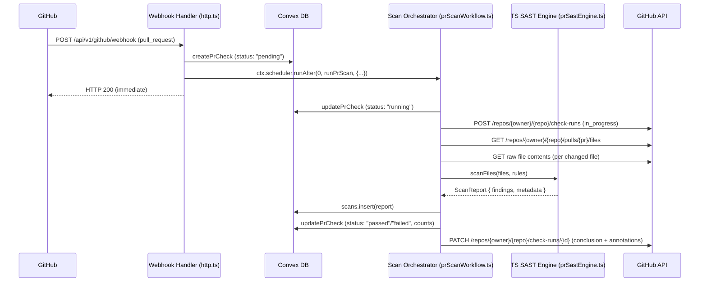
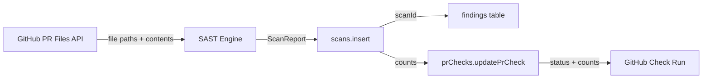

# Design Document: PR Scan Workflow

## Overview

This design implements the end-to-end PR scan workflow for the Sicario platform. When a `pull_request` webhook arrives (opened/synchronize), the existing webhook handler in `http.ts` creates a `prChecks` record but currently has a TODO where the scan should be triggered. This design fills that gap by:

1. Scheduling a Convex Node.js action (`runPrScan`) from the webhook handler
2. The action fetches changed files from GitHub using the installation token
3. A lightweight TypeScript SAST engine runs regex + pattern matching on the changed files (reimplementing the core SAST rule matching from `sicario-cli` without needing the Rust binary)
4. Results are stored via `scans.insert` and findings are created
5. The `prChecks` record is updated with pass/fail status
6. A GitHub Check Run is posted back to the PR

### Key Design Decision: TypeScript SAST Engine vs. Rust Binary

The Rust `sicario-cli` binary cannot run inside Convex actions. Rather than hosting it as a separate HTTP service (adding infrastructure complexity), we reimplement the core SAST pattern matching in TypeScript for the PR diff use case. This is viable because:

- PR scans only analyze changed files (typically <100 files), not entire repositories
- The SAST rules use regex patterns that can be evaluated in TypeScript
- The tree-sitter AST queries from the Rust engine are converted to equivalent regex patterns for the TypeScript engine
- The YAML rule files are loaded and parsed at scan time
- This avoids external service dependencies and keeps the entire workflow within Convex's action runtime

The TypeScript engine is intentionally simpler — it trades the precision of tree-sitter AST matching for portability and zero-infrastructure overhead. For PR-scoped scans on changed files, this is an acceptable tradeoff.

## Architecture



### Component Layout

```
convex/convex/
├── http.ts                  # Webhook handler (modified: schedule scan action)
├── prChecks.ts              # PR check mutations/queries (existing)
├── prScanWorkflow.ts        # NEW: Scan orchestrator action ("use node")
├── prSastEngine.ts          # NEW: TypeScript SAST engine (pure functions)
├── prSastRules.ts           # NEW: Embedded SAST rules (converted from YAML)
├── scans.ts                 # Scan storage (existing)
├── findings.ts              # Findings storage (existing)
├── githubApp.ts             # GitHub JWT/token helpers (existing)
├── githubAppNode.ts         # Node.js GitHub action (existing)
└── schema.ts                # Schema (existing, no changes needed)
```

## Components and Interfaces

### 1. Webhook Handler Modification (`http.ts`)

The existing `pull_request` webhook handler is modified to schedule the scan orchestrator action after creating the `prChecks` record.

```typescript
// In the "opened" || "synchronize" branch, after createPrCheck:
const installationId = matchedProject.github_app_installation_id;
if (!installationId) {
  await ctx.runMutation(api.prChecks.updatePrCheck, {
    checkId,
    status: "failed",
  });
} else {
  await ctx.scheduler.runAfter(0, api.prScanWorkflow.runPrScan, {
    checkId,
    repositoryUrl: repoUrl,
    prNumber,
    projectId,
    orgId,
    installationId,
  });
}
```

### 2. Scan Orchestrator (`prScanWorkflow.ts`)

A `"use node"` Convex action that orchestrates the full scan lifecycle. Uses Node.js APIs for crypto (JWT signing) and makes HTTP calls to GitHub.

```typescript
// prScanWorkflow.ts
"use node";

import { action } from "./_generated/server";
import { v } from "convex/values";
import { api } from "./_generated/api";

export const runPrScan = action({
  args: {
    checkId: v.string(),
    repositoryUrl: v.string(),
    prNumber: v.number(),
    projectId: v.string(),
    orgId: v.string(),
    installationId: v.string(),
  },
  handler: async (ctx, args) => {
    // 1. Update status to "running"
    // 2. Acquire installation token
    // 3. Create GitHub Check Run (in_progress)
    // 4. Fetch changed files from PR
    // 5. Fetch file contents
    // 6. Run SAST scan
    // 7. Store scan results
    // 8. Determine pass/fail based on severity threshold
    // 9. Update prCheck record
    // 10. Update GitHub Check Run with conclusion + annotations
  },
});
```

**Interface:**

| Method | Input | Output |
|--------|-------|--------|
| `runPrScan` | `{ checkId, repositoryUrl, prNumber, projectId, orgId, installationId }` | `void` (side effects: DB writes, GitHub API calls) |

### 3. TypeScript SAST Engine (`prSastEngine.ts`)

A pure-function module that performs regex-based pattern matching on source code. No external dependencies — just string/regex operations.

```typescript
export interface SastRule {
  id: string;
  name: string;
  description: string;
  severity: "Critical" | "High" | "Medium" | "Low" | "Info";
  languages: string[];
  pattern: RegExp;
  cweId?: string;
  owaspCategory?: string;
}

export interface ScanFinding {
  ruleId: string;
  ruleName: string;
  filePath: string;
  line: number;
  column: number;
  snippet: string;
  severity: string;
  cweId?: string;
  owaspCategory?: string;
  fingerprint: string;
}

export interface ScanReport {
  metadata: {
    repository: string;
    branch: string;
    commitSha: string;
    timestamp: string;
    durationMs: number;
    rulesLoaded: number;
    filesScanned: number;
    languageBreakdown: Record<string, number>;
    tags: string[];
  };
  findings: ScanFinding[];
}

export interface FileToScan {
  path: string;
  content: string;
  language: string;
}

// Core scan function
export function scanFiles(
  files: FileToScan[],
  rules: SastRule[],
  metadata: { repository: string; branch: string; commitSha: string }
): ScanReport;

// Detect language from file extension
export function detectLanguage(filePath: string): string | null;

// Compute finding fingerprint
export function computeFingerprint(
  ruleId: string,
  filePath: string,
  snippet: string
): string;

// Determine pass/fail based on severity threshold
export function evaluateThreshold(
  findings: ScanFinding[],
  threshold: string
): { passed: boolean; criticalCount: number; highCount: number; totalCount: number };
```

### 4. Embedded SAST Rules (`prSastRules.ts`)

The YAML rules from `sicario-cli/rules/` are converted to TypeScript regex patterns. Each tree-sitter query is approximated as a regex that catches the same vulnerability patterns.

```typescript
export const PR_SAST_RULES: SastRule[] = [
  {
    id: "js-sql-string-concat",
    name: "SQL Query with String Concatenation",
    severity: "High",
    languages: ["JavaScript", "TypeScript"],
    pattern: /(?:SELECT|INSERT|UPDATE|DELETE|DROP|ALTER|CREATE)\s.*\+\s/i,
    cweId: "CWE-89",
    owaspCategory: "A03_Injection",
  },
  // ... more rules converted from YAML
];
```

### 5. GitHub API Interactions

The orchestrator interacts with three GitHub API endpoints:

| Endpoint | Method | Purpose |
|----------|--------|---------|
| `/app/installations/{id}/access_tokens` | POST | Acquire installation token |
| `/repos/{owner}/{repo}/pulls/{pr}/files` | GET | List changed files |
| `/repos/{owner}/{repo}/check-runs` | POST | Create Check Run |
| `/repos/{owner}/{repo}/check-runs/{id}` | PATCH | Update Check Run with conclusion |

All GitHub API calls use the installation token with `Accept: application/vnd.github+json` and `User-Agent: sicario-security-app` headers, consistent with the existing `githubApp.ts` patterns.

### 6. Severity Threshold Evaluation

The pass/fail decision uses the project's `severityThreshold` field (default: `"high"`). The severity hierarchy is:

```
Critical > High > Medium > Low > Info
```

A PR check fails if any finding has severity >= the threshold. The `evaluateThreshold` function maps severity strings to numeric values and compares.

## Data Models

### Existing Tables (No Schema Changes Required)

The existing schema already supports all data needed for the PR scan workflow:

**`prChecks` table:**
- `checkId: string` — unique identifier
- `projectId: string` — linked project
- `orgId: string` — linked organization
- `prNumber: number` — PR number
- `prTitle: string` — PR title
- `repositoryUrl: string` — repo URL
- `status: string` — "pending" | "running" | "passed" | "failed"
- `findingsCount: number` — total findings
- `criticalCount: number` — critical severity count
- `highCount: number` — high severity count
- `githubCheckRunId: string?` — GitHub Check Run ID
- `createdAt: string` — ISO timestamp
- `updatedAt: string` — ISO timestamp

**`scans` table:** Stores scan metadata (repository, branch, commit, duration, files scanned, language breakdown). Linked to project and org via `projectId` and `orgId`.

**`findings` table:** Stores individual findings with `findingId`, `scanId`, `ruleId`, `ruleName`, `filePath`, `line`, `column`, `snippet`, `severity`, `confidenceScore`, `fingerprint`, `triageState`, `orgId`, `projectId`.

### Data Flow



### Key Data Transformations

1. **GitHub PR file → FileToScan**: Extract `filename`, `status` (filter to "added"/"modified"), download `raw_url` content
2. **ScanFinding → findings table row**: Map `ruleId` → `ruleId`, compute `findingId` as UUID, set `triageState: "Open"`, compute `fingerprint` from `ruleId + filePath + snippet`
3. **ScanReport → scans table row**: Map metadata fields, generate `scanId`, tag with `["pr-scan"]`
4. **findings → Check Run annotations**: Map up to 50 findings to GitHub annotation objects with `path`, `start_line`, `annotation_level` (mapped from severity), `message`, `title`


## Correctness Properties

*A property is a characteristic or behavior that should hold true across all valid executions of a system — essentially, a formal statement about what the system should do. Properties serve as the bridge between human-readable specifications and machine-verifiable correctness guarantees.*

### Property 1: Finding file paths reference input file paths

*For any* set of input files with arbitrary file paths and contents, every finding produced by `scanFiles` SHALL have a `filePath` that exactly matches one of the input file paths.

**Validates: Requirements 3.2**

### Property 2: Scan report contains all required metadata

*For any* set of input files and metadata (repository, branch, commitSha), the `ScanReport` returned by `scanFiles` SHALL contain non-null values for `repository`, `branch`, `commitSha`, `timestamp`, `durationMs`, `rulesLoaded`, `filesScanned`, `languageBreakdown`, and `tags`, and `filesScanned` SHALL equal the number of input files.

**Validates: Requirements 3.3**

### Property 3: Fingerprint determinism

*For any* ruleId, filePath, and snippet strings, calling `computeFingerprint(ruleId, filePath, snippet)` twice with the same arguments SHALL produce identical results, and calling it with any different argument SHALL produce a different result (collision resistance).

**Validates: Requirements 4.4**

### Property 4: Threshold evaluation correctness

*For any* list of `ScanFinding` objects and any valid severity threshold, `evaluateThreshold` SHALL return `passed: true` if and only if no finding has severity at or above the threshold. Conversely, it SHALL return `passed: false` if and only if at least one finding has severity at or above the threshold.

**Validates: Requirements 5.1, 5.2**

### Property 5: Finding severity counts are accurate

*For any* list of `ScanFinding` objects, `evaluateThreshold` SHALL return `criticalCount` equal to the number of findings with severity "Critical", `highCount` equal to the number with severity "High", and `totalCount` equal to the total number of findings.

**Validates: Requirements 5.3**

### Property 6: Check Run summary contains required information

*For any* finding counts (total, critical, high) and severity threshold string, the generated Check Run summary string SHALL contain the total count, critical count, high count, and the threshold value.

**Validates: Requirements 6.3**

### Property 7: Annotations are capped and well-formed

*For any* list of findings (including lists with more than 50 items), the generated annotations array SHALL contain at most 50 entries, and each annotation SHALL include a non-empty `path`, a positive `start_line`, a non-empty `annotation_level`, and a non-empty `message`.

**Validates: Requirements 6.4**

## Error Handling

### GitHub API Failures

| Scenario | Handling |
|----------|----------|
| Installation token acquisition fails | Set prCheck status to "failed", log error, abort scan |
| PR files API returns non-2xx | Set prCheck status to "failed", log error, abort scan |
| File content download fails for individual file | Skip that file, continue scanning remaining files |
| Check Run creation fails (POST) | Log error, continue scan workflow (findings still stored) |
| Check Run update fails (PATCH) | Log error, scan results are already stored in DB |

### Scan Engine Failures

| Scenario | Handling |
|----------|----------|
| SAST engine throws exception | Set prCheck status to "failed", log error |
| Individual rule regex fails | Skip that rule, continue with remaining rules |
| File content is binary/unparseable | Skip that file, continue scanning |

### Timeout Handling

The orchestrator wraps the entire workflow in a timeout guard. If the 120-second limit is exceeded:
1. Update prCheck status to "failed" with error message indicating timeout
2. Any partial results already stored remain in the database
3. If a Check Run was created, attempt to update it with "failure" conclusion

### Concurrency

Each scan operates on its own `checkId`. The webhook handler creates a new `prChecks` record for each event (including re-pushes to the same PR). There is no shared mutable state between concurrent scans — each action reads/writes only its own records.

## Testing Strategy

### Property-Based Tests (fast-check)

The project already has `fast-check` as a dev dependency. Property-based tests will validate the pure-function components of the scan workflow:

- **prSastEngine.ts**: `scanFiles`, `computeFingerprint`, `evaluateThreshold`, `detectLanguage`
- **Annotation/summary formatters**: Check Run output generation

Each property test runs a minimum of 100 iterations using `fast-check`'s `fc.assert` with `fc.property`.

Tag format: `Feature: pr-scan-workflow, Property {N}: {description}`

### Unit Tests (vitest)

Example-based tests for:
- Webhook handler scheduling logic (mock `ctx.scheduler.runAfter`)
- Error handling paths (GitHub API failures, missing installation ID)
- Status transitions (pending → running → passed/failed)
- Language detection from file extensions
- Rule matching against known vulnerable code snippets (from the existing YAML test cases)

### Integration Tests

- End-to-end scan workflow with mocked GitHub API responses
- Verify scan records and findings are correctly inserted into the database
- Verify prCheck record is updated with correct status and counts

### Test File Organization

```
convex/convex/__tests__/
├── pr-scan-engine.test.ts          # Property + unit tests for SAST engine
├── pr-scan-threshold.test.ts       # Property tests for threshold evaluation
├── pr-scan-fingerprint.test.ts     # Property tests for fingerprint computation
├── pr-scan-annotations.test.ts     # Property tests for Check Run output
└── pr-scan-workflow.test.ts        # Integration tests for orchestrator
```
