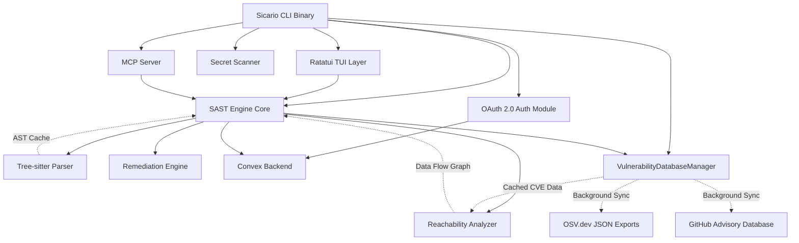
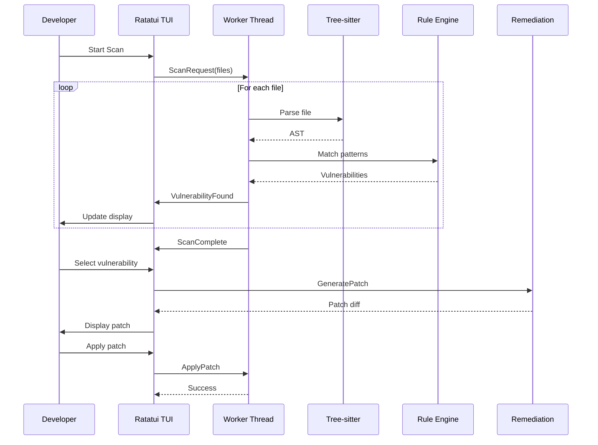

# Design Document: Sicario CLI Core

## Overview

The Sicario CLI is a high-performance security scanning tool built entirely in Rust, designed to achieve 10x performance improvements over legacy Python and Node.js-based SAST tools. The architecture leverages tree-sitter for ultra-fast AST parsing, Ratatui for an award-winning terminal interface, and native multithreading via Rayon for parallel analysis. The system integrates OAuth 2.0 Device Flow for secure authentication, implements the Model Context Protocol for AI agent integration, and provides autonomous code remediation capabilities.

The core design philosophy prioritizes developer velocity by eliminating false positives through reachability analysis, providing instant visual feedback through a responsive TUI, and transforming security from a blocking gate into a productivity multiplier through automated fixes.

## Architecture

### High-Level System Architecture



### Threading Model

The application uses a multi-threaded architecture to ensure UI responsiveness while performing intensive computation:

1. **Main Thread**: Runs the Ratatui event loop, handles user input, and renders the TUI
2. **Worker Pool**: Rayon thread pool for parallel file parsing and rule matching
3. **Background Thread**: Handles async I/O for Convex WebSocket connections and OAuth polling
4. **MCP Server Thread**: Listens for incoming MCP protocol connections
5. **VulnDB Sync Thread**: Periodically fetches delta updates from OSV.dev and GHSA in the background, writing to the local cache without blocking the AST parsing worker pool or the TUI event loop

Communication between threads uses Rust's `mpsc` channels for message passing:
- Worker threads send `ScanProgress` and `VulnerabilityFound` messages to the main thread
- Main thread sends `ScanRequest` and `ApplyPatch` commands to workers
- Background thread sends `RulesetUpdate` and `AuthComplete` events to main thread
- VulnDB sync thread sends `DbSyncComplete` and `DbSyncError` events to the main thread; the local SQLite cache is the shared read path for all scan workers, so no blocking coordination is required during scans

### Data Flow



## Components and Interfaces

### 1. Tree-sitter Parsing Engine

**Responsibility**: Parse source code into concrete syntax trees at native speeds with intelligent file exclusion

**Interface**:
```rust
pub struct TreeSitterEngine {
    parsers: HashMap<Language, Parser>,
    ast_cache: LruCache<PathBuf, Tree>,
    exclusion_manager: ExclusionManager,
}

pub struct ExclusionManager {
    gitignore_patterns: Vec<Pattern>,
    sicarioignore_patterns: Vec<Pattern>,
    default_excludes: Vec<Pattern>,
}

impl TreeSitterEngine {
    pub fn parse_file(&mut self, path: &Path) -> Result<Tree>;
    pub fn get_cached_ast(&self, path: &Path) -> Option<&Tree>;
    pub fn clear_cache(&mut self);
    pub fn should_scan_file(&self, path: &Path) -> bool;
}

impl ExclusionManager {
    pub fn new(project_root: &Path) -> Result<Self>;
    pub fn is_excluded(&self, path: &Path) -> bool;
    pub fn load_sicarioignore(&mut self, path: &Path) -> Result<()>;
}
```

**Implementation Details**:
- Uses `tree-sitter` crate with language-specific grammars (tree-sitter-javascript, tree-sitter-python, etc.)
- Maintains an LRU cache of parsed ASTs to avoid redundant parsing
- Detects language from file extension and selects appropriate parser
- Returns concrete syntax trees that preserve all source information including whitespace
- Integrates `ExclusionManager` to filter files before parsing:
  - Automatically respects `.gitignore` patterns using `ignore` crate
  - Loads custom `.sicarioignore` file from project root if present
  - Default excludes: `node_modules/`, `dist/`, `build/`, `target/`, `.git/`, `*.min.js`, `*.bundle.js`
- `.sicarioignore` syntax matches `.gitignore` (glob patterns, negation with `!`, comments with `#`)
- Before parsing any file, checks `should_scan_file()` to avoid wasting CPU on excluded paths

### 2. SAST Engine Core

**Responsibility**: Apply security rules to ASTs and detect vulnerabilities; orchestrate SCA manifest scanning against the local vulnerability database

**Interface**:
```rust
pub struct SastEngine {
    rules: Vec<SecurityRule>,
    tree_sitter: TreeSitterEngine,
    reachability: ReachabilityAnalyzer,
    vuln_db: Arc<VulnerabilityDatabaseManager>,
}

pub struct SecurityRule {
    pub id: String,
    pub severity: Severity,
    pub pattern: QueryPattern,
    pub message: String,
}

pub struct Vulnerability {
    pub rule_id: String,
    pub file_path: PathBuf,
    pub line: usize,
    pub column: usize,
    pub snippet: String,
    pub severity: Severity,
    pub reachable: bool,
}

impl SastEngine {
    pub fn load_rules(&mut self, yaml_path: &Path) -> Result<()>;
    pub fn scan_file(&self, path: &Path) -> Result<Vec<Vulnerability>>;
    pub fn scan_directory(&self, dir: &Path) -> Result<Vec<Vulnerability>>;
    /// Parse dependency manifests (package.json, Cargo.toml, requirements.txt),
    /// look up each dependency version range against the local CVE cache, and
    /// pipe any matches into the ReachabilityAnalyzer to confirm exploitability.
    pub fn scan_manifests(&self, dir: &Path) -> Result<Vec<Vulnerability>>;
}
```

**Implementation Details**:
- Loads YAML rules and compiles them into tree-sitter query patterns
- Uses Rayon's `par_iter()` to scan multiple files concurrently
- For each file, retrieves or parses AST, then applies all rules
- Invokes reachability analyzer for dependency-related vulnerabilities
- `scan_manifests()` reads `package.json` (npm), `Cargo.toml` (Rust), and `requirements.txt` (Python) to extract declared dependency names and version constraints; queries `VulnerabilityDatabaseManager::query_package()` for each; for any hit, constructs a synthetic `Vulnerability` and passes the affected package's call sites to `ReachabilityAnalyzer::is_reachable()` to eliminate false positives before surfacing the finding
- Returns vulnerabilities sorted by severity and reachability

### 3. Secret Scanner

**Responsibility**: Detect and verify hardcoded credentials in source code and git history with inline suppression support

**Interface**:
```rust
pub struct SecretScanner {
    patterns: Vec<SecretPattern>,
    verifiers: HashMap<SecretType, Box<dyn SecretVerifier>>,
    suppression_parser: SuppressionParser,
}

pub struct SecretPattern {
    pub secret_type: SecretType,
    pub regex: Regex,
    pub entropy_threshold: f64,
}

pub trait SecretVerifier {
    fn verify(&self, secret: &str) -> Result<bool>;
}

pub struct SuppressionParser {
    tree_sitter: TreeSitterEngine,
}

impl SecretScanner {
    pub fn scan_staged_files(&self) -> Result<Vec<DetectedSecret>>;
    pub fn scan_git_history(&self, repo: &Path) -> Result<Vec<DetectedSecret>>;
    pub fn verify_secret(&self, secret: &DetectedSecret) -> Result<bool>;
    pub fn is_suppressed(&self, file: &Path, line: usize) -> Result<bool>;
}

impl SuppressionParser {
    pub fn check_suppression_comment(&self, file: &Path, line: usize) -> Result<bool>;
}
```

**Implementation Details**:
- Compiles regex patterns for AWS keys, Stripe tokens, GitHub PATs, database URLs, etc.
- Uses `git2` crate to traverse git history and staged files
- Calculates Shannon entropy to reduce false positives on random strings
- Implements verifiers for each secret type:
  - AWS: Calls STS GetCallerIdentity API
  - GitHub: Calls /user API endpoint
  - Stripe: Calls /v1/charges API with test mode
- Runs verification in parallel using Rayon
- Before flagging a secret, checks for inline suppression comments:
  - `// sicario-ignore-secret` (JavaScript, TypeScript, Rust, Go, Java)
  - `# sicario-ignore-secret` (Python, Ruby, Shell)
  - `<!-- sicario-ignore-secret -->` (HTML, XML)
- Uses tree-sitter to parse comment nodes and detect suppression directives
- Suppression applies to the next line of code after the comment
- Returns only verified, active, non-suppressed credentials

### 4. Ratatui TUI

**Responsibility**: Provide responsive, visually rich terminal interface

**Interface**:
```rust
pub struct SicarioTui {
    terminal: Terminal<CrosstermBackend<Stdout>>,
    state: AppState,
    rx: Receiver<TuiMessage>,
}

pub enum AppState {
    Welcome,
    Scanning { progress: f64, files_scanned: usize },
    Results { vulnerabilities: Vec<Vulnerability>, selected: usize },
    PatchPreview { vulnerability: Vulnerability, patch: String },
}

pub enum TuiMessage {
    ScanProgress { files_scanned: usize, total: usize },
    VulnerabilityFound(Vulnerability),
    ScanComplete,
    PatchGenerated(String),
    Error(String),
}

impl SicarioTui {
    pub fn run(&mut self) -> Result<()>;
    fn handle_input(&mut self, event: Event) -> Result<()>;
    fn render(&mut self) -> Result<()>;
}
```

**Implementation Details**:
- Uses `ratatui` crate with `crossterm` backend for cross-platform terminal control
- Implements immediate-mode rendering at 60 FPS
- Runs event loop on main thread, checking for keyboard input and channel messages
- Uses `ratatui::widgets` for progress bars, lists, and syntax-highlighted code blocks
- Applies gradient styling and box borders for visual polish
- Maintains responsive UI by never blocking on worker threads

### 5. Reachability Analyzer

**Responsibility**: Trace data flow from external input to vulnerable code paths; serve as the false-positive elimination layer for SCA findings

**Interface**:
```rust
pub struct ReachabilityAnalyzer {
    call_graph: CallGraph,
    taint_sources: Vec<TaintSource>,
}

pub struct CallGraph {
    nodes: HashMap<FunctionId, FunctionNode>,
    edges: Vec<(FunctionId, FunctionId)>,
}

pub struct TaintSource {
    pub source_type: SourceType,
    pub pattern: QueryPattern,
}

pub enum SourceType {
    HttpRequest,
    UserInput,
    FileRead,
    EnvironmentVariable,
}

impl ReachabilityAnalyzer {
    pub fn build_call_graph(&mut self, files: &[PathBuf]) -> Result<()>;
    pub fn is_reachable(&self, vulnerability: &Vulnerability) -> Result<bool>;
    pub fn trace_taint_flow(&self, source: &TaintSource, sink: &FunctionId) -> Option<Vec<FunctionId>>;
    /// Given a known CVE entry from the vulnerability database, determine whether
    /// the application's call graph actually invokes the vulnerable function exported
    /// by the affected package, eliminating the standard SCA false-positive noise.
    pub fn is_vulnerable_dependency_reachable(
        &self,
        known_vuln: &KnownVulnerability,
        package_call_sites: &[FunctionId],
    ) -> Result<bool>;
}
```

**Implementation Details**:
- Builds inter-procedural call graph by analyzing function calls across all files
- Identifies taint sources using framework-specific patterns:
  - Django: `request.GET`, `request.POST`, `request.body`
  - FastAPI: function parameters with `Request` type
  - React: component props
- Performs forward data-flow analysis from taint sources to vulnerability locations
- Uses worklist algorithm with fixed-point iteration
- Returns true if any path exists from external input to vulnerable code
- `is_vulnerable_dependency_reachable()` receives the set of call sites in the project that invoke the affected package's API surface (resolved by `SastEngine::scan_manifests()`), then walks the call graph to determine if any of those call sites are reachable from an external taint source; a dependency is only surfaced as a confirmed finding when this walk succeeds

### 6. Remediation Engine

**Responsibility**: Generate and apply code patches to fix vulnerabilities using AI-powered code generation

**Interface**:
```rust
pub struct RemediationEngine {
    tree_sitter: TreeSitterEngine,
    ai_client: CerebrasClient,
    backup_manager: BackupManager,
}

pub struct Patch {
    pub id: Uuid,
    pub file_path: PathBuf,
    pub original: String,
    pub fixed: String,
    pub diff: String,
    pub backup_path: PathBuf,
}

pub struct CerebrasClient {
    api_key: String,
    endpoint: String,
    model: String,
}

pub struct BackupManager {
    backup_dir: PathBuf,
}

impl RemediationEngine {
    pub fn generate_patch(&self, vulnerability: &Vulnerability) -> Result<Patch>;
    pub fn apply_patch(&self, patch: &Patch) -> Result<()>;
    pub fn revert_patch(&self, patch: &Patch) -> Result<()>;
    pub fn create_pull_request(&self, patch: &Patch, git_provider: &GitProvider) -> Result<String>;
}

impl CerebrasClient {
    pub async fn generate_fix(&self, context: &FixContext) -> Result<String>;
}

impl BackupManager {
    pub fn backup_file(&self, file_path: &Path) -> Result<PathBuf>;
    pub fn restore_file(&self, backup_path: &Path, original_path: &Path) -> Result<()>;
    pub fn cleanup_old_backups(&self, days: u64) -> Result<()>;
}
```

**Implementation Details**:
- Uses AST manipulation to extract vulnerability context (surrounding code, function signatures, imports)
- Constructs a `FixContext` containing:
  - Vulnerability description and CWE ID
  - Code snippet with 10 lines of context before/after
  - File language and framework information
  - Relevant security rule that triggered the finding
- Sends context to Cerebras API (or compatible LLM endpoint) with a specialized system prompt for security fixes
- Implements fix strategies for common vulnerability types:
  - SQL Injection: Replace string concatenation with parameterized queries
  - XSS: Add HTML escaping functions
  - Hardcoded secrets: Replace with environment variable lookups
  - Complex logic flaws: Use LLM-generated fixes
- Before applying any patch, creates a backup in `.sicario/backups/{timestamp}/{file_path}`
- Generates unified diff format using `similar` crate
- Applies patches by rewriting source files with proper formatting
- Maintains a patch history log for audit trail
- Provides `revert_patch()` to restore original file from backup
- Integrates with GitHub/GitLab APIs to create PRs with patch content

### 7. OAuth 2.0 Auth Module

**Responsibility**: Authenticate CLI with backend using Device Flow + PKCE

**Interface**:
```rust
pub struct AuthModule {
    client_id: String,
    auth_server_url: String,
    token_store: TokenStore,
}

pub struct DeviceCodeResponse {
    pub device_code: String,
    pub user_code: String,
    pub verification_uri: String,
    pub interval: u64,
}

pub struct TokenResponse {
    pub access_token: String,
    pub refresh_token: String,
    pub expires_in: u64,
}

impl AuthModule {
    pub fn initiate_device_flow(&self) -> Result<DeviceCodeResponse>;
    pub fn poll_for_token(&self, device_code: &str, code_verifier: &str) -> Result<TokenResponse>;
    pub fn refresh_token(&self) -> Result<TokenResponse>;
    pub fn get_access_token(&self) -> Result<String>;
}
```

**Implementation Details**:
- Generates cryptographically random `code_verifier` (43-128 characters)
- Computes `code_challenge` as base64url(SHA256(code_verifier))
- Sends POST to `/oauth/device/code` with client_id and code_challenge
- Displays verification_uri and user_code in TUI
- Polls `/oauth/token` endpoint every `interval` seconds with device_code and code_verifier
- Stores tokens in system keychain using `keyring` crate
- Automatically refreshes access token when expired

### 8. MCP Server

**Responsibility**: Expose security scanning via Model Context Protocol

**Interface**:
```rust
pub struct McpServer {
    engine: Arc<SastEngine>,
    listener: TcpListener,
}

pub struct McpRequest {
    pub method: String,
    pub params: serde_json::Value,
}

pub struct McpResponse {
    pub result: serde_json::Value,
}

impl McpServer {
    pub fn start(&self, port: u16) -> Result<()>;
    fn handle_connection(&self, stream: TcpStream) -> Result<()>;
    fn handle_scan_request(&self, params: serde_json::Value) -> Result<Vec<Vulnerability>>;
}
```

**Implementation Details**:
- Listens on localhost TCP port for MCP client connections
- Implements JSON-RPC 2.0 protocol as specified by MCP
- Exposes methods:
  - `scan_file`: Accepts file path, returns vulnerabilities
  - `scan_code`: Accepts source code string, returns vulnerabilities
  - `get_rules`: Returns available security rules
- Runs scans on worker thread pool to avoid blocking MCP responses
- Maintains Assistant Memory by storing triage decisions in local SQLite database

### 9. Convex Backend Client

**Responsibility**: Sync telemetry and rulesets with Convex backend

**Interface**:
```rust
pub struct ConvexClient {
    ws_url: String,
    auth_token: String,
    connection: WebSocketStream,
}

pub struct TelemetryEvent {
    pub timestamp: DateTime<Utc>,
    pub vulnerability: Vulnerability,
    pub action: TelemetryAction,
}

pub enum TelemetryAction {
    Detected,
    Dismissed,
    Fixed,
}

impl ConvexClient {
    pub fn connect(&mut self, auth_token: &str) -> Result<()>;
    pub fn push_telemetry(&self, event: TelemetryEvent) -> Result<()>;
    pub fn subscribe_rulesets(&self) -> Result<Receiver<Vec<SecurityRule>>>;
}
```

**Implementation Details**:
- Uses `tokio-tungstenite` for WebSocket connections
- Includes JWT in Authorization header during WebSocket handshake
- Sends telemetry as JSON messages over WebSocket
- Subscribes to Convex query for organizational rulesets
- Receives real-time updates when rulesets change
- Validates JWT signature using WorkOS public keys (handled by Convex)

### 10. Vulnerability Database Manager

**Responsibility**: Fetch, parse, and locally cache known CVEs and malicious package signatures from open-source intelligence feeds (OSV.dev and GitHub Advisory Database), providing a fast offline lookup path for SCA scans

**Interface**:
```rust
pub struct VulnerabilityDatabaseManager {
    db: Arc<rusqlite::Connection>,  // embedded SQLite via rusqlite
    cache_dir: PathBuf,
    sync_tx: mpsc::Sender<DbSyncEvent>,
}

pub enum DbSyncEvent {
    SyncStarted,
    SyncComplete { new_entries: usize },
    SyncError(String),
}

pub struct OsvEcosystem {
    pub name: String,          // e.g. "npm", "PyPI", "crates.io"
    pub export_url: String,    // OSV.dev bulk JSON export endpoint
}

impl VulnerabilityDatabaseManager {
    /// Initialize the manager, creating the SQLite schema if it does not exist.
    pub fn new(cache_dir: &Path) -> Result<Self>;

    /// Spawn the background sync thread. Fetches delta updates from OSV.dev
    /// JSON ecosystem exports and the GHSA REST API without blocking the caller.
    /// Sends DbSyncEvent messages over the provided channel.
    pub fn start_background_sync(
        &self,
        interval: Duration,
        tx: mpsc::Sender<DbSyncEvent>,
    ) -> JoinHandle<()>;

    /// Query the local cache for all known vulnerabilities affecting a specific
    /// package name and version. Returns an empty Vec when the package is clean.
    pub fn query_package(
        &self,
        ecosystem: &str,
        package_name: &str,
        version: &str,
    ) -> Result<Vec<KnownVulnerability>>;

    /// Force an immediate synchronization from all configured upstream sources.
    /// Intended for use on first run or when the user explicitly requests a refresh.
    pub fn sync_now(&self) -> Result<usize>;

    /// Return the timestamp of the most recent successful sync.
    pub fn last_synced_at(&self) -> Result<Option<DateTime<Utc>>>;
}
```

**Implementation Details**:
- Uses `rusqlite` with an embedded SQLite database stored at `~/.sicario/vuln_cache.db`; no external database process is required, keeping the binary self-contained
- Schema: a single `known_vulnerabilities` table indexed on `(ecosystem, package_name)` for sub-millisecond lookups during scans
- **OSV.dev integration**: Downloads bulk JSON exports from `https://osv-vulnerabilities.storage.googleapis.com/{ecosystem}/all.zip` for each configured ecosystem (npm, PyPI, crates.io, Maven, Go); parses the OSV JSON schema into `KnownVulnerability` structs; uses the `modified` field for delta detection to avoid re-importing unchanged records
- **GHSA integration**: Queries the GitHub Advisory Database GraphQL API (`https://api.github.com/graphql`) using the `securityVulnerabilities` query, paginating through results and upserting into the local cache; GHSA IDs are stored alongside CVE IDs for cross-referencing
- **Background sync thread**: Spawned via `std::thread::spawn`; sleeps for the configured interval (default 24 hours) between sync cycles; writes exclusively to SQLite while scan workers read concurrently — SQLite WAL mode ensures no read contention
- **Version range matching**: Implements semantic version range evaluation using the `semver` crate; OSV `affected[].ranges` entries (SEMVER, ECOSYSTEM, GIT) are normalized to semver ranges before storage; `query_package()` evaluates the installed version against stored ranges entirely in-process without network I/O
- **Offline-first**: If the cache is populated, all SCA lookups succeed without network access; a stale cache warning is surfaced in the TUI if `last_synced_at` is older than 7 days

## Data Models

### Vulnerability

```rust
pub struct Vulnerability {
    pub id: Uuid,
    pub rule_id: String,
    pub file_path: PathBuf,
    pub line: usize,
    pub column: usize,
    pub snippet: String,
    pub severity: Severity,
    pub reachable: bool,
    pub cloud_exposed: Option<bool>,
    pub cwe_id: Option<String>,
    pub owasp_category: Option<String>,
}

pub enum Severity {
    Critical,
    High,
    Medium,
    Low,
    Info,
}

pub enum OwaspCategory {
    A01_BrokenAccessControl,
    A02_CryptographicFailures,
    A03_Injection,
    A04_InsecureDesign,
    A05_SecurityMisconfiguration,
    A06_VulnerableComponents,
    A07_IdentificationAuthFailures,
    A08_SoftwareDataIntegrityFailures,
    A09_SecurityLoggingFailures,
    A10_ServerSideRequestForgery,
}
```

### Security Rule

```rust
pub struct SecurityRule {
    pub id: String,
    pub name: String,
    pub description: String,
    pub severity: Severity,
    pub languages: Vec<Language>,
    pub pattern: QueryPattern,
    pub fix_template: Option<String>,
    pub cwe_id: Option<String>,
    pub owasp_category: Option<OwaspCategory>,
}

pub struct QueryPattern {
    pub query: String, // Tree-sitter query syntax
    pub captures: Vec<String>,
}
```

**OWASP Mapping Strategy**:
- Each security rule in the YAML ruleset includes an `owasp_category` field
- Common mappings:
  - SQL Injection, XSS, Command Injection → A03_Injection
  - Hardcoded secrets, weak crypto → A02_CryptographicFailures
  - Missing authentication checks → A07_IdentificationAuthFailures
  - Vulnerable dependencies → A06_VulnerableComponents
  - SSRF vulnerabilities → A10_ServerSideRequestForgery
- When displaying results in TUI or pushing to Convex, vulnerabilities are grouped by OWASP category
- Compliance reports show coverage across all OWASP Top 10 categories

### Detected Secret

```rust
pub struct DetectedSecret {
    pub secret_type: SecretType,
    pub value: String,
    pub file_path: PathBuf,
    pub line: usize,
    pub verified: bool,
}

pub enum SecretType {
    AwsAccessKey,
    AwsSecretKey,
    GithubPat,
    StripeKey,
    DatabaseUrl,
    PrivateKey,
    GenericApiKey,
}
```

### Call Graph

```rust
pub struct FunctionNode {
    pub id: FunctionId,
    pub name: String,
    pub file_path: PathBuf,
    pub line: usize,
    pub calls: Vec<FunctionId>,
    pub called_by: Vec<FunctionId>,
    pub parameters: Vec<Parameter>,
}

pub struct Parameter {
    pub name: String,
    pub tainted: bool,
}

pub type FunctionId = Uuid;
```

### Known Vulnerability

Represents an external CVE/GHSA record fetched from open-source intelligence feeds and stored in the local cache. This is distinct from a `Vulnerability`, which represents a finding in the user's own code.

```rust
pub struct KnownVulnerability {
    /// Primary CVE identifier, e.g. "CVE-2021-44228"
    pub cve_id: Option<String>,
    /// GitHub Security Advisory identifier, e.g. "GHSA-jfh8-c2jp-hdp9"
    pub ghsa_id: Option<String>,
    /// Ecosystem-scoped package name, e.g. "log4j-core" (Maven) or "lodash" (npm)
    pub package_name: String,
    /// Ecosystem the package belongs to: "npm", "PyPI", "crates.io", "Maven", "Go"
    pub ecosystem: String,
    /// Semver ranges that are affected, e.g. [">= 2.0.0, < 2.15.0"]
    pub vulnerable_versions: Vec<String>,
    /// First version in which the vulnerability is patched, e.g. "2.15.1"
    pub patched_version: Option<String>,
    /// Human-readable summary sourced from OSV or GHSA
    pub summary: String,
    /// Severity derived from CVSS score or OSV severity field
    pub severity: Severity,
    /// OWASP category mapping for compliance reporting
    pub owasp_category: Option<OwaspCategory>,
    /// Timestamp of the last time this record was synced from upstream
    pub last_synced_at: DateTime<Utc>,
}
```

## Correctness Properties

*A property is a characteristic or behavior that should hold true across all valid executions of a system—essentially, a formal statement about what the system should do. Properties serve as the bridge between human-readable specifications and machine-verifiable correctness guarantees.*

### Property 1: Secret pattern detection completeness

*For any* string containing a credential pattern (AWS keys, Stripe tokens, GitHub PATs, database connection strings), the Secret Scanner should detect and identify the credential type using regex compilation.

**Validates: Requirements 1.2**

### Property 2: Active credential verification accuracy

*For any* detected credential that matches a known pattern, the verification result should accurately reflect whether the credential is currently valid and active on the origin service by querying the appropriate API endpoint.

**Validates: Requirements 1.3**

### Property 3: Verified credential blocking

*For any* verified active credential detected in staged files, the Secret Scanner should block the commit and display the credential location with surrounding context.

**Validates: Requirements 1.4**

### Property 4: Git history traversal completeness

*For any* git repository structure with multiple commits and branches, scanning the git history should traverse all commits and branches without requiring full repository clones.

**Validates: Requirements 1.5**

### Property 5: Parallel parsing correctness

*For any* set of source files, parsing them in parallel across multiple threads using Rayon should produce identical AST results as parsing them sequentially, regardless of thread count or scheduling order.

**Validates: Requirements 2.3**

### Property 6: AST cache consistency

*For any* file that has been parsed and cached, retrieving the cached AST should return an equivalent tree to re-parsing the file, as long as the file content has not changed.

**Validates: Requirements 2.4**

### Property 7: YAML rule compilation correctness

*For any* syntactically valid YAML security rule, the SAST engine should successfully parse the rule syntax and compile it into executable AST pattern matchers without errors.

**Validates: Requirements 3.2**

### Property 8: Rule metadata preservation

*For any* security rule match in source code, the captured metadata (file path, line number, matched code snippet, severity level) should accurately correspond to the location and context of the matched pattern.

**Validates: Requirements 3.4**

### Property 9: Custom rule merging

*For any* set of custom security rules provided alongside default rulesets, the SAST engine should merge them without conflicts, preserving all rules from both sets.

**Validates: Requirements 3.5**

### Property 10: Message passing reliability

*For any* message sent from worker threads to the TUI via mpsc channels, that message should be received and processed by the TUI in the order it was sent, without loss or corruption.

**Validates: Requirements 4.5**

### Property 11: TUI responsiveness under load

*For any* user input event (keypress, scroll action) during active scanning, the Ratatui TUI should process and respond to that event without blocking or frame drops, maintaining UI responsiveness.

**Validates: Requirements 4.6**

### Property 12: Reachability analysis soundness

*For any* vulnerability marked as reachable, there should exist at least one valid execution path from an external input source (HTTP request, user input, file read, environment variable) through the call graph to the vulnerable code location, with tainted variables correctly traced across function boundaries and multiple files.

**Validates: Requirements 5.1, 5.2, 5.3**

### Property 13: Unreachable vulnerability suppression

*For any* vulnerability in a dependency that is not reachable from external input, the SAST engine should mark it as low priority or suppress it, reducing false positives.

**Validates: Requirements 5.4**

### Property 14: Framework pattern recognition

*For any* source code using framework-specific patterns (Django decorators, FastAPI middleware, React component props), the reachability analyzer should correctly identify these patterns as taint sources or sinks according to framework semantics.

**Validates: Requirements 5.5**

### Property 15: MCP protocol compliance

*For any* valid MCP client request conforming to the Model Context Protocol specification, the MCP server should respond with a correctly formatted response that satisfies the protocol requirements.

**Validates: Requirements 6.1**

### Property 16: MCP scan result accuracy

*For any* source code or file path provided via MCP, the returned vulnerability findings should be identical to those produced by a direct CLI scan of the same code.

**Validates: Requirements 6.3**

### Property 17: MCP non-blocking execution

*For any* AI agent invocation of the MCP server, the server should execute background security traces on worker threads without blocking the client connection, maintaining responsiveness.

**Validates: Requirements 6.4**

### Property 18: Assistant Memory pattern dismissal

*For any* vulnerability pattern that has been previously approved in historical triage decisions, the MCP server should autonomously dismiss identical patterns in future scans using Assistant Memory.

**Validates: Requirements 6.5**

### Property 19: OAuth Device Flow compliance

*For any* authentication attempt, the Auth Module should implement the complete OAuth 2.0 Device Authorization Grant flow per RFC 8628, including requesting device_code, user_code, and verification_uri, displaying them to the user, and asynchronously polling the token endpoint.

**Validates: Requirements 7.1**

### Property 20: PKCE cryptographic binding

*For any* device flow authentication, the code_challenge sent in the initial request should be the base64url-encoded SHA-256 hash of the code_verifier presented during token retrieval, ensuring cryptographic proof of client identity per RFC 7636.

**Validates: Requirements 7.6**

### Property 21: Token storage security

*For any* received access token or refresh token, the Auth Module should store it in the system keychain and never write it to plaintext files or environment variables.

**Validates: Requirements 7.7**

### Property 22: Telemetry data integrity

*For any* detected vulnerability, the telemetry data pushed to Convex should accurately represent all vulnerability attributes including file path, vulnerability type, severity, and timestamp.

**Validates: Requirements 8.2**

### Property 23: Real-time ruleset synchronization

*For any* ruleset update made in the Convex backend, all connected CLI instances should receive the update via WebSocket subscription and apply the new rules to subsequent scans.

**Validates: Requirements 8.4**

### Property 24: Patch correctness and syntax validity

*For any* vulnerability with a defined fix template, the generated patch should produce syntactically valid code that resolves the vulnerability without introducing new syntax errors or breaking existing functionality.

**Validates: Requirements 9.1, 9.2**

### Property 25: Patch application idempotence

*For any* patch applied to a file, applying the same patch again should either succeed with no changes or correctly detect that the patch has already been applied, maintaining idempotence.

**Validates: Requirements 9.4**

### Property 26: Auto-detection accuracy

*For any* project directory containing language-specific files and manifest files (package.json, requirements.txt, go.mod, Cargo.toml), the zero-configuration detection should correctly identify all programming languages, package managers, and web frameworks present.

**Validates: Requirements 10.2**

### Property 27: Rule configuration based on detection

*For any* set of detected technologies (languages and frameworks), the CLI should automatically configure optimal security rule subsets that are relevant to those technologies without requiring user input.

**Validates: Requirements 10.3**

### Property 28: Cloud exposure determination

*For any* vulnerability in code deployed to cloud infrastructure, the CLI should correctly determine whether the affected service is publicly exposed to the internet based on Kubernetes configurations or CSPM data.

**Validates: Requirements 11.2**

### Property 29: Priority assignment by exposure

*For any* two identical vulnerabilities where one is in a publicly exposed service and one is in an internal isolated service, the CLI should assign higher priority (critical) to the publicly exposed vulnerability and lower priority to the internal one.

**Validates: Requirements 11.3, 11.4**

### Property 30: Binary portability and independence

*For any* compiled Sicario CLI binary for a target platform (Linux, macOS, or Windows), it should execute successfully on that platform without requiring additional runtime dependencies or libraries, with a binary footprint under 50MB.

**Validates: Requirements 12.4**

### Property 31: LLM-generated patch syntax validity

*For any* vulnerability where the Remediation Engine uses the Cerebras API to generate a fix, the returned code should be syntactically valid for the target language before being presented to the user.

**Validates: Requirements 13.4**

### Property 32: Patch backup creation

*For any* patch applied to a file, the Remediation Engine should create a backup of the original file in `.sicario/backups/` before making any modifications, ensuring rollback capability.

**Validates: Requirements 14.1**

### Property 33: Patch revert correctness

*For any* applied patch with a valid backup, calling `revert_patch()` should restore the file to its exact original state as it existed before the patch was applied.

**Validates: Requirements 14.3**

### Property 34: Exclusion pattern effectiveness

*For any* file path that matches a pattern in `.gitignore`, `.sicarioignore`, or default exclusions (node_modules/, dist/, *.min.js), the Tree-sitter Engine should skip parsing that file entirely.

**Validates: Requirements 15.1, 15.2, 15.3, 15.4**

### Property 35: Inline suppression recognition

*For any* line of code preceded by a suppression comment (`// sicario-ignore-secret` or `# sicario-ignore-secret`), the Secret Scanner should skip secret detection for that line regardless of whether a credential pattern is present.

**Validates: Requirements 16.1, 16.2**

### Property 36: OWASP category mapping consistency

*For any* vulnerability detected by a security rule with an `owasp_category` field, the resulting Vulnerability struct should include the same OWASP category, ensuring consistent compliance mapping.

**Validates: Requirements 17.1, 17.2**

### Property 37: OWASP compliance report completeness

*For any* scan that detects vulnerabilities across multiple OWASP categories, the compliance report should accurately group and count findings by category, covering all applicable OWASP Top 10 2021 categories.

**Validates: Requirements 17.3, 17.4, 17.5**

## Error Handling

### Error Categories

1. **Parse Errors**: Invalid syntax in source files or YAML rules
   - Strategy: Return detailed error with line/column information, continue scanning other files

2. **I/O Errors**: File not found, permission denied, network failures
   - Strategy: Log error, display in TUI, allow user to retry or skip

3. **Authentication Errors**: Invalid tokens, expired sessions, network timeouts
   - Strategy: Prompt user to re-authenticate, provide clear error messages

4. **Verification Errors**: API rate limits, service unavailable during secret verification
   - Strategy: Mark secret as "unverified" rather than failing, allow manual review

5. **AST Errors**: Unsupported language, corrupted tree-sitter grammar
   - Strategy: Fall back to regex-based scanning, warn user about reduced accuracy

### Error Propagation

- Use Rust's `Result<T, E>` type throughout the codebase
- Define custom error types using `thiserror` crate for rich error context
- Propagate errors up to TUI layer for user-facing display
- Log all errors to file for debugging (using `tracing` crate)
- Never panic in production code; use `Result` and graceful degradation

### Recovery Strategies

- **Transient failures**: Implement exponential backoff retry for network operations
- **Partial failures**: Continue scanning remaining files if one file fails
- **State corruption**: Detect and rebuild AST cache if corruption detected
- **Resource exhaustion**: Implement memory limits and graceful degradation when exceeded

## Testing Strategy

### Unit Testing

Unit tests will verify specific examples and edge cases for individual components:

- **Tree-sitter parsing**: Test parsing of valid and invalid syntax for each supported language
- **Secret detection**: Test regex patterns against known secret formats and false positives
- **Rule matching**: Test YAML rule compilation and pattern matching against sample code
- **Patch generation**: Test fix templates produce correct transformations
- **OAuth flow**: Test PKCE generation, token storage, and refresh logic
- **Error handling**: Test error propagation and recovery for each error category

### Property-Based Testing

Property-based tests will validate universal correctness properties across randomized inputs using the `proptest` crate. Each test will run a minimum of 100 iterations.

**Configuration**: All property tests will use `proptest` with the following configuration:
```rust
proptest! {
    #![proptest_config(ProptestConfig::with_cases(100))]
    // test implementation
}
```

**Test Organization**: Property tests will be co-located with unit tests in each module's test file, clearly marked with comments referencing the design property number.

**Property Test Examples**:

1. **Property 3: AST parsing determinism**
   - Generate random valid source code
   - Parse multiple times
   - Assert all ASTs are structurally equivalent
   - Tag: `Feature: sicario-cli-core, Property 3: AST parsing determinism`

2. **Property 4: Parallel parsing correctness**
   - Generate random set of source files
   - Parse sequentially and in parallel
   - Assert results are identical
   - Tag: `Feature: sicario-cli-core, Property 4: Parallel parsing correctness`

3. **Property 8: Pattern matching accuracy**
   - Generate random security rules and source code
   - Apply rules and verify matches satisfy pattern specifications
   - Tag: `Feature: sicario-cli-core, Property 8: Pattern matching accuracy`

4. **Property 13: Reachability analysis soundness**
   - Generate random call graphs with taint sources
   - For each vulnerability marked reachable, verify path exists
   - Tag: `Feature: sicario-cli-core, Property 13: Reachability analysis soundness`

5. **Property 19: PKCE cryptographic binding**
   - Generate random code_verifier values
   - Compute code_challenge and verify SHA-256 relationship
   - Tag: `Feature: sicario-cli-core, Property 19: PKCE cryptographic binding`

### Integration Testing

Integration tests will verify end-to-end workflows:

- **Full scan workflow**: Initialize CLI, scan sample repository, verify vulnerabilities detected
- **Authentication flow**: Simulate OAuth device flow with mock server, verify token storage
- **MCP integration**: Start MCP server, send requests from mock client, verify responses
- **Convex sync**: Connect to test Convex instance, push telemetry, verify data received
- **Remediation workflow**: Detect vulnerability, generate patch, apply to file, verify fix

### Performance Testing

Benchmark tests will validate the 10x performance claim:

- **Parsing speed**: Measure time to parse large repositories (100k+ LOC)
- **Scanning throughput**: Measure vulnerabilities detected per second
- **Memory usage**: Monitor memory footprint during large scans
- **TUI responsiveness**: Measure frame time and input latency under load
- **Comparison baseline**: Run equivalent scans with Python-based tools for comparison

### Testing Tools

- `cargo test`: Standard Rust test runner
- `proptest`: Property-based testing framework
- `criterion`: Benchmarking framework for performance tests
- `mockito`: HTTP mocking for API integration tests
- `tokio-test`: Async testing utilities for WebSocket and MCP tests
