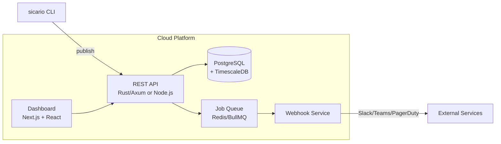

# Design Document: Sicario CLI Overhaul

## Overview

This design transforms Sicario from a working SAST prototype with hand-rolled argument parsing and ~20 rules into a production-grade, fundable security platform. The overhaul touches every layer of the existing `sicario-cli` crate while preserving the core architecture: tree-sitter for AST parsing, Rayon for parallel scanning, Ratatui for TUI, and tokio/reqwest for async AI remediation.

The design is organized into three tiers:

1. **CLI Foundation** (Reqs 1–3, 18–19): Replace hand-rolled arg parsing with clap derive API, add structured exit codes, output modes, professional formatting, and advanced scan control.
2. **Engine Expansion** (Reqs 4–8, 9–12, 14, 16–17, 25–26): Scale rule coverage to 100+ per language, add SARIF output, diff-aware scanning, inline suppressions, confidence scoring, learning suppressions, post-fix verification, rule quality enforcement, and incremental caching.
3. **Platform & Integrations** (Reqs 13, 15, 20–24): GitHub Action, baseline tracking, BYOK key management, cloud dashboard, pre-commit hooks, VS Code extension/LSP, and performance benchmarking.

The existing single-crate workspace (`sicario-cli`) is preserved. New functionality is added as new modules within the crate, and existing modules are extended rather than rewritten.

## Architecture

### System Component Diagram

```mermaid
graph TB
    subgraph "CLI Layer (clap)"
        CLI[sicario binary<br/>clap derive API]
        CLI --> ScanCmd[scan]
        CLI --> FixCmd[fix]
        CLI --> InitCmd[init]
        CLI --> BaselineCmd[baseline]
        CLI --> TuiCmd[tui]
        CLI --> HookCmd[hook]
        CLI --> LspCmd[lsp]
        CLI --> BenchCmd[benchmark]
        CLI --> ConfigCmd[config]
        CLI --> PublishCmd[publish]
        CLI --> LoginCmd[login/logout/whoami]
        CLI --> CompletionsCmd[completions]
        CLI --> SuppressionsCmd[suppressions]
        CLI --> ReportCmd[report]
        CLI --> RulesCmd[rules]
        CLI --> CacheCmd[cache]
    end

    subgraph "Output Layer"
        Formatter[Output_Formatter<br/>indicatif + owo-colors]
        SarifEmitter[SARIF_Emitter<br/>v2.1.0]
        JsonEmitter[JSON Emitter]
    end

    subgraph "Engine Layer"
        SastEngine[SAST_Engine<br/>tree-sitter + Rayon]
        RuleLoader[Rule_Loader<br/>YAML → compiled queries]
        ConfScorer[Confidence_Scorer<br/>reachability + pattern + context]
        DiffScanner[Diff_Scanner<br/>git2]
        ScanCache[Scan_Cache<br/>SHA-256 content-addressable]
        SuppressionParser[Suppression_Parser<br/>inline comments]
        SuppressionLearner[Suppression_Learner<br/>pattern learning]
        VerificationScanner[Verification_Scanner<br/>post-fix re-scan]
        RuleTestHarness[Rule_Test_Harness<br/>TP/TN validation]
    end

    subgraph "Remediation Layer"
        RemEngine[Remediation_Engine]
        LlmClient[LLM_Client<br/>OpenAI-compatible]
        TemplateFixes[Template Fixes<br/>SQLi, XSS, CmdInj]
        BackupMgr[Backup_Manager]
    end

    subgraph "Integration Layer"
        BaselineMgr[Baseline_Manager<br/>JSON snapshots]
        HookMgr[Hook_Manager<br/>pre-commit]
        LspServer[LSP_Server<br/>stdin/stdout JSON-RPC]
        BenchRunner[Benchmark_Runner]
        KeyMgr[Key_Manager<br/>keyring crate]
        PublishClient[Publish_Client<br/>Cloud API]
    end

    subgraph "Cloud Platform (separate deployment)"
        CloudAPI[REST API<br/>OpenAPI v1]
        CloudDB[(PostgreSQL)]
        CloudFrontend[Web Dashboard<br/>React/Next.js]
        Webhooks[Webhook Dispatcher]
    end

    ScanCmd --> SastEngine
    ScanCmd --> Formatter
    ScanCmd --> SarifEmitter
    ScanCmd --> DiffScanner
    ScanCmd --> ScanCache
    FixCmd --> RemEngine
    FixCmd --> VerificationScanner
    BaselineCmd --> BaselineMgr
    HookCmd --> HookMgr
    LspCmd --> LspServer
    BenchCmd --> BenchRunner
    ConfigCmd --> KeyMgr
    PublishCmd --> PublishClient
    RulesCmd --> RuleTestHarness

    SastEngine --> RuleLoader
    SastEngine --> ConfScorer
    SastEngine --> SuppressionParser
    SastEngine --> SuppressionLearner
    RemEngine --> LlmClient
    RemEngine --> TemplateFixes
    RemEngine --> BackupMgr
    LspServer --> SastEngine
    PublishClient --> CloudAPI
    CloudAPI --> CloudDB
    CloudAPI --> Webhooks
    CloudFrontend --> CloudAPI
```



### Module Structure

New modules are added alongside existing ones in `sicario-cli/src/`. The existing module tree is extended, not replaced.

```
sicario-cli/src/
├── main.rs                    # MODIFIED: clap entry point replaces hand-rolled parsing
├── lib.rs                     # MODIFIED: add new module declarations
├── cli/                       # NEW: clap command definitions
│   ├── mod.rs                 #   Top-level SicarioCli struct + subcommand enum
│   ├── scan.rs                #   ScanArgs struct
│   ├── fix.rs                 #   FixArgs struct
│   ├── baseline.rs            #   BaselineArgs struct
│   ├── config.rs              #   ConfigArgs struct
│   ├── hook.rs                #   HookArgs struct
│   ├── lsp.rs                 #   LspArgs struct
│   ├── benchmark.rs           #   BenchmarkArgs struct
│   ├── rules.rs               #   RulesArgs struct
│   ├── cache.rs               #   CacheArgs struct
│   └── suppressions.rs        #   SuppressionsArgs struct
├── parser/                    # EXISTING: unchanged
│   ├── mod.rs
│   ├── tree_sitter_engine.rs
│   └── exclusion_manager.rs   # MODIFIED: add --include/--exclude-rule support
├── engine/                    # EXISTING: extended
│   ├── mod.rs
│   ├── sast_engine.rs         # MODIFIED: add cache integration, confidence scoring hooks
│   ├── security_rule.rs       # MODIFIED: add test_cases field for rule quality
│   ├── vulnerability.rs       # MODIFIED: add confidence_score, fingerprint fields
│   ├── reachability.rs        # EXISTING: unchanged
│   └── sca/                   # EXISTING: unchanged
├── scanner/                   # EXISTING: extended
│   ├── suppression_parser.rs  # MODIFIED: add rule-specific suppression, all comment styles
│   └── ...
├── output/                    # NEW: professional output formatting
│   ├── mod.rs
│   ├── formatter.rs           #   Color-coded tables, progress bars, summary banners
│   ├── sarif.rs               #   SARIF v2.1.0 emitter
│   └── branded.rs             #   ASCII logo, version display
├── diff/                      # NEW: diff-aware scanning
│   ├── mod.rs
│   └── diff_scanner.rs        #   git2-based changed-line computation
├── confidence/                # NEW: AI confidence scoring
│   ├── mod.rs
│   └── scorer.rs              #   Multi-signal confidence computation
├── baseline/                  # NEW: security debt tracking
│   ├── mod.rs
│   └── manager.rs             #   Baseline save/compare/trend
├── suppression_learner/       # NEW: learning suppressions
│   ├── mod.rs
│   └── learner.rs             #   Pattern recording and suggestion
├── verification/              # NEW: post-fix verification
│   ├── mod.rs
│   └── scanner.rs             #   Re-scan after fix
├── cache/                     # NEW: incremental scanning cache
│   ├── mod.rs
│   └── scan_cache.rs          #   Content-addressable AST cache
├── hook/                      # NEW: pre-commit hook management
│   ├── mod.rs
│   └── manager.rs             #   Install/uninstall/status
├── lsp/                       # NEW: Language Server Protocol
│   ├── mod.rs
│   └── server.rs              #   LSP JSON-RPC over stdin/stdout
├── benchmark/                 # NEW: performance benchmarking
│   ├── mod.rs
│   └── runner.rs              #   Timing, memory, per-language breakdown
├── rule_harness/              # NEW: rule quality enforcement
│   ├── mod.rs
│   └── harness.rs             #   TP/TN test execution, quality reports
├── key_manager/               # NEW: BYOK key management
│   ├── mod.rs
│   └── manager.rs             #   keyring integration, precedence resolution
├── publish/                   # NEW: cloud publish client
│   ├── mod.rs
│   └── client.rs              #   Authenticated upload to Cloud API
├── remediation/               # EXISTING: extended
│   ├── remediation_engine.rs  # MODIFIED: multi-provider, template fallback expansion
│   ├── cerebras_client.rs     # RENAMED → llm_client.rs: generic OpenAI-compatible
│   ├── backup_manager.rs      # EXISTING: unchanged
│   └── patch.rs               # EXISTING: unchanged
├── tui/                       # EXISTING: unchanged
├── auth/                      # EXISTING: extended for cloud login
├── cloud/                     # EXISTING: extended for publish
├── convex/                    # EXISTING: unchanged
├── mcp/                       # EXISTING: unchanged
├── onboarding/                # EXISTING: unchanged
└── reporting/                 # EXISTING: extended for SARIF
```

### New Dependencies

Added to `[workspace.dependencies]` in the root `Cargo.toml`:

```toml
# CLI framework
clap = { version = "4.5", features = ["derive", "env", "string"] }
clap_complete = "4.5"

# Professional output
indicatif = "0.17"
owo-colors = "4.0"
comfy-table = "7.1"
console = "0.15"

# SARIF output
serde_json = "1.0"  # already present

# LSP server
lsp-server = "0.7"
lsp-types = "0.95"

# Benchmarking
sysinfo = "0.30"
```

All other dependencies (`tree-sitter-*`, `rayon`, `ratatui`, `crossterm`, `tokio`, `reqwest`, `git2`, `rusqlite`, `serde`, `keyring`, `similar`, `proptest`) are already in the workspace.

## Components and Interfaces

### 1. CLI Layer (`cli/`)

The `cli/mod.rs` defines the top-level clap struct:

```rust
use clap::{Parser, Subcommand};

#[derive(Parser)]
#[command(name = "sicario", version, about = "Next-gen SAST security scanner")]
pub struct SicarioCli {
    #[command(subcommand)]
    pub command: Option<Command>,
}

#[derive(Subcommand)]
pub enum Command {
    Scan(ScanArgs),
    Init,
    Report(ReportArgs),
    Fix(FixArgs),
    Baseline(BaselineCommand),
    Config(ConfigCommand),
    Suppressions(SuppressionsCommand),
    Completions(CompletionsArgs),
    Login,
    Logout,
    Publish(PublishArgs),
    Whoami,
    Tui(TuiArgs),
    Hook(HookCommand),
    Lsp,
    Benchmark(BenchmarkArgs),
    Rules(RulesCommand),
    Cache(CacheCommand),
}
```

When `command` is `None`, the CLI defaults to launching the TUI (backward compatibility with current behavior).

### 2. SARIF Emitter (`output/sarif.rs`)

Implements SARIF v2.1.0 serialization. The emitter maps internal `Finding` structs to the SARIF schema:

```rust
pub trait SarifEmitter {
    fn emit(&self, findings: &[Finding], tool_version: &str) -> Result<SarifDocument>;
}
```

Severity mapping: `Critical/High → "error"`, `Medium → "warning"`, `Low/Info → "note"`.

Confidence scores are included as `properties.rank` (0–100 scale) on each result.

### 3. Diff Scanner (`diff/diff_scanner.rs`)

Uses `git2` to compute changed lines between HEAD and a reference:

```rust
pub trait DiffScanning {
    fn changed_lines(&self, reference: &str) -> Result<HashMap<PathBuf, HashSet<usize>>>;
    fn staged_files(&self) -> Result<Vec<PathBuf>>;
}
```

### 4. Confidence Scorer (`confidence/scorer.rs`)

Computes a deterministic 0.0–1.0 score per finding:

```rust
pub trait ConfidenceScoring {
    fn score(&self, finding: &Finding, reachability: &ReachabilityResult) -> f64;
}
```

Three signals: reachability (0.4 weight), pattern specificity (0.3 weight), contextual indicators (0.3 weight).

### 5. Baseline Manager (`baseline/manager.rs`)

Persists and compares scan snapshots:

```rust
pub trait BaselineManagement {
    fn save(&self, findings: &[Finding], tag: Option<&str>) -> Result<PathBuf>;
    fn compare(&self, tag_or_timestamp: &str) -> Result<BaselineDelta>;
    fn trend(&self) -> Result<Vec<BaselineSummary>>;
}
```

Finding identity across baselines uses a stable fingerprint: `SHA-256(rule_id + file_path + snippet_hash)`.

### 6. Suppression Learner (`suppression_learner/learner.rs`)

Records suppression patterns and suggests auto-suppressions:

```rust
pub trait SuppressionLearning {
    fn record(&mut self, finding: &Finding, ast_context: &str) -> Result<()>;
    fn suggest(&self, finding: &Finding) -> Option<SuppressionSuggestion>;
    fn auto_suppress(&self, findings: &[Finding]) -> Vec<Finding>;
}
```

Threshold: 3+ suppressions for the same rule ID with similar AST context triggers suggestions.

### 7. Verification Scanner (`verification/scanner.rs`)

Re-scans a file after fix application:

```rust
pub trait VerificationScanning {
    fn verify_fix(&self, file: &Path, original_finding: &Finding) -> Result<VerificationResult>;
}

pub enum VerificationResult {
    Resolved,
    StillPresent,
    NewFindingsIntroduced(Vec<Finding>),
}
```

### 8. Scan Cache (`cache/scan_cache.rs`)

Content-addressable cache keyed by SHA-256 of file contents:

```rust
pub trait ScanCaching {
    fn get(&self, file_hash: &str) -> Option<CachedScanResult>;
    fn put(&mut self, file_hash: &str, result: CachedScanResult) -> Result<()>;
    fn invalidate_language(&mut self, language: Language) -> Result<()>;
    fn clear(&mut self) -> Result<()>;
    fn stats(&self) -> CacheStats;
}
```

Cache storage: `.sicario/cache/` directory with one JSON file per cached file, named by content hash.

### 9. LSP Server (`lsp/server.rs`)

Implements LSP JSON-RPC over stdin/stdout using the `lsp-server` crate:

```rust
pub struct SicarioLspServer {
    engine: SastEngine,
    debounce_ms: u64,  // 500ms default
}
```

Supported methods: `textDocument/didOpen`, `textDocument/didChange`, `textDocument/didSave`, `textDocument/didClose`, `textDocument/publishDiagnostics`, `textDocument/codeAction`.

Findings map to `Diagnostic` objects: `Critical/High → DiagnosticSeverity::Error`, `Medium → Warning`, `Low/Info → Information`.

### 10. Hook Manager (`hook/manager.rs`)

Manages `.git/hooks/pre-commit`:

```rust
pub trait HookManagement {
    fn install(&self, severity_threshold: Severity) -> Result<()>;
    fn uninstall(&self) -> Result<()>;
    fn status(&self) -> Result<HookStatus>;
}
```

Install appends to existing hooks rather than overwriting. Uninstall removes only the Sicario invocation.

### 11. Rule Test Harness (`rule_harness/harness.rs`)

Validates rule quality:

```rust
pub struct RuleTestCase {
    pub code: String,
    pub expected: TestExpectation,  // TruePositive or TrueNegative
    pub language: Language,
}

pub trait RuleQualityValidation {
    fn validate_rule(&self, rule: &SecurityRule) -> Result<RuleQualityReport>;
    fn validate_all(&self) -> Result<AggregateQualityReport>;
}
```

Each rule must ship with ≥3 TP and ≥3 TN test cases. Aggregate FP rate must be <15%.

### 12. LLM Client (`remediation/llm_client.rs`)

Replaces the Cerebras-specific client with a generic OpenAI-compatible client:

```rust
pub struct LlmClient {
    endpoint: String,   // from SICARIO_LLM_ENDPOINT
    api_key: String,    // resolved via Key_Manager precedence
    model: String,      // from SICARIO_LLM_MODEL, default "llama3.1-8b"
    client: reqwest::Client,
    timeout: Duration,  // 30s
}
```

Key resolution order: `SICARIO_LLM_API_KEY` env → OS keyring → `CEREBRAS_API_KEY` env.

### 13. Cloud Platform Architecture

The cloud platform is a separate deployment (not part of the CLI crate):



**API**: Versioned REST (v1), OpenAPI spec, JWT auth via OAuth browser flow.
**Database**: PostgreSQL with TimescaleDB extension for time-series analytics (MTTR, trend data).
**Frontend**: Next.js with React, server-side rendering for dashboard pages.
**RBAC**: Organization → Teams → Projects hierarchy. Roles: Admin, Manager, Developer.
**SSO**: SAML 2.0 and OpenID Connect via an auth middleware.

The CLI's `publish` command uploads a `ScanReport` payload:

```rust
pub struct ScanReport {
    pub findings: Vec<Finding>,
    pub metadata: ScanMetadata,
}

pub struct ScanMetadata {
    pub repository: String,
    pub branch: String,
    pub commit_sha: String,
    pub timestamp: chrono::DateTime<chrono::Utc>,
    pub duration_ms: u64,
    pub rules_loaded: usize,
    pub files_scanned: usize,
    pub language_breakdown: HashMap<Language, usize>,
    pub tags: Vec<String>,
}
```

## Data Models

### Core Finding (extended Vulnerability)

The existing `Vulnerability` struct is extended with new fields:

```rust
#[derive(Debug, Clone, Serialize, Deserialize)]
pub struct Finding {
    pub id: Uuid,
    pub rule_id: String,
    pub rule_name: String,
    pub file_path: PathBuf,
    pub line: usize,
    pub column: usize,
    pub end_line: Option<usize>,
    pub end_column: Option<usize>,
    pub snippet: String,
    pub severity: Severity,
    pub confidence_score: f64,          // NEW: 0.0–1.0
    pub reachable: bool,
    pub cloud_exposed: Option<bool>,
    pub cwe_id: Option<String>,
    pub owasp_category: Option<OwaspCategory>,
    pub fingerprint: String,            // NEW: stable identity hash
    pub dataflow_trace: Option<Vec<TraceStep>>,  // NEW: source→sink path
    pub suppressed: bool,               // NEW: inline suppression status
    pub suppression_rule: Option<String>, // NEW: which rule-id was suppressed
    pub suggested_suppression: bool,     // NEW: learning suppression flag
}

#[derive(Debug, Clone, Serialize, Deserialize)]
pub struct TraceStep {
    pub file_path: PathBuf,
    pub line: usize,
    pub column: usize,
    pub description: String,
}
```

### SecurityRule (extended)

```rust
#[derive(Debug, Clone, Serialize, Deserialize)]
pub struct SecurityRule {
    pub id: String,
    pub name: String,
    pub description: String,
    pub severity: Severity,
    pub languages: Vec<Language>,
    pub pattern: QueryPattern,
    pub fix_template: Option<String>,
    pub cwe_id: Option<String>,
    pub owasp_category: Option<OwaspCategory>,
    pub help_uri: Option<String>,           // NEW: link to docs
    pub test_cases: Option<Vec<RuleTestCase>>,  // NEW: TP/TN test cases
}

#[derive(Debug, Clone, Serialize, Deserialize)]
pub struct RuleTestCase {
    pub code: String,
    pub expected: TestExpectation,
    pub language: Language,
}

#[derive(Debug, Clone, Serialize, Deserialize)]
pub enum TestExpectation {
    TruePositive,
    TrueNegative,
}
```

### SARIF Data Model

```rust
#[derive(Debug, Clone, Serialize, Deserialize)]
pub struct SarifDocument {
    #[serde(rename = "$schema")]
    pub schema: String,  // "https://raw.githubusercontent.com/oasis-tcs/sarif-spec/main/sarif-2.1/schema/sarif-schema-2.1.0.json"
    pub version: String, // "2.1.0"
    pub runs: Vec<SarifRun>,
}

#[derive(Debug, Clone, Serialize, Deserialize)]
pub struct SarifRun {
    pub tool: SarifTool,
    pub results: Vec<SarifResult>,
}

#[derive(Debug, Clone, Serialize, Deserialize)]
pub struct SarifTool {
    pub driver: SarifDriver,
}

#[derive(Debug, Clone, Serialize, Deserialize)]
pub struct SarifDriver {
    pub name: String,
    pub version: String,
    #[serde(rename = "semanticVersion")]
    pub semantic_version: String,
    pub rules: Vec<SarifRule>,
}

#[derive(Debug, Clone, Serialize, Deserialize)]
pub struct SarifRule {
    pub id: String,
    pub name: String,
    #[serde(rename = "shortDescription")]
    pub short_description: SarifMessage,
    #[serde(rename = "fullDescription")]
    pub full_description: SarifMessage,
    #[serde(rename = "helpUri")]
    pub help_uri: Option<String>,
    #[serde(rename = "defaultConfiguration")]
    pub default_configuration: SarifRuleConfig,
}

#[derive(Debug, Clone, Serialize, Deserialize)]
pub struct SarifResult {
    #[serde(rename = "ruleId")]
    pub rule_id: String,
    pub message: SarifMessage,
    pub level: String,  // "error", "warning", "note"
    pub locations: Vec<SarifLocation>,
    pub taxa: Option<Vec<SarifTaxon>>,
    pub properties: Option<SarifPropertyBag>,
}

#[derive(Debug, Clone, Serialize, Deserialize)]
pub struct SarifPropertyBag {
    pub rank: Option<f64>,  // confidence 0–100
}
```

### Baseline Data Model

```rust
#[derive(Debug, Clone, Serialize, Deserialize)]
pub struct Baseline {
    pub timestamp: chrono::DateTime<chrono::Utc>,
    pub tag: Option<String>,
    pub commit_sha: Option<String>,
    pub findings: Vec<BaselineFinding>,
}

#[derive(Debug, Clone, Serialize, Deserialize)]
pub struct BaselineFinding {
    pub fingerprint: String,
    pub rule_id: String,
    pub file_path: PathBuf,
    pub line: usize,
    pub severity: Severity,
    pub confidence_score: f64,
    pub snippet_hash: String,
}

#[derive(Debug, Clone, Serialize, Deserialize)]
pub struct BaselineDelta {
    pub new_findings: Vec<BaselineFinding>,
    pub resolved_findings: Vec<BaselineFinding>,
    pub unchanged_findings: Vec<BaselineFinding>,
}
```

### Learned Suppression Data Model

```rust
#[derive(Debug, Clone, Serialize, Deserialize)]
pub struct LearnedSuppression {
    pub rule_id: String,
    pub ast_node_type: String,
    pub context_hash: String,
    pub match_count: usize,
    pub example_snippet: String,
    pub first_seen: chrono::DateTime<chrono::Utc>,
    pub last_seen: chrono::DateTime<chrono::Utc>,
}
```

### Cache Data Model

```rust
#[derive(Debug, Clone, Serialize, Deserialize)]
pub struct CachedScanResult {
    pub file_hash: String,          // SHA-256 of file contents
    pub rule_set_hash: String,      // SHA-256 of loaded rule files
    pub findings: Vec<Finding>,
    pub cached_at: chrono::DateTime<chrono::Utc>,
}

#[derive(Debug, Clone, Serialize, Deserialize)]
pub struct CacheStats {
    pub size_bytes: u64,
    pub cached_files: usize,
    pub hit_rate: f64,
    pub oldest_entry: Option<chrono::DateTime<chrono::Utc>>,
}
```

### Exit Code Enum

```rust
#[derive(Debug, Clone, Copy, PartialEq, Eq)]
pub enum ExitCode {
    Clean = 0,
    FindingsDetected = 1,
    InternalError = 2,
}
```

### Benchmark Data Model

```rust
#[derive(Debug, Clone, Serialize, Deserialize)]
pub struct BenchmarkResult {
    pub timestamp: chrono::DateTime<chrono::Utc>,
    pub total_wall_clock_ms: u64,
    pub files_per_second: f64,
    pub rules_per_second: f64,
    pub peak_memory_bytes: u64,
    pub per_language: HashMap<Language, LanguageBenchmark>,
}

#[derive(Debug, Clone, Serialize, Deserialize)]
pub struct LanguageBenchmark {
    pub files_scanned: usize,
    pub scan_time_ms: u64,
    pub rules_evaluated: usize,
}
```

## Correctness Properties

*A property is a characteristic or behavior that should hold true across all valid executions of a system — essentially, a formal statement about what the system should do. Properties serve as the bridge between human-readable specifications and machine-verifiable correctness guarantees.*

### Property 1: Exit code correctness

*For any* list of Findings with random severities and confidence scores, and *for any* severity threshold and confidence threshold, the CLI exit code SHALL be 0 if and only if zero Findings have both severity ≥ threshold AND confidence ≥ confidence threshold AND are not suppressed; otherwise the exit code SHALL be 1.

**Validates: Requirements 2.1, 2.2, 2.4, 2.6, 12.5**

### Property 2: Rule loading round-trip

*For any* valid `SecurityRule` struct (with valid tree-sitter query syntax, valid severity, and at least one supported language), serializing to YAML and loading via the `Rule_Loader` SHALL produce a compiled rule that matches the same AST patterns as the original — no code changes to the SAST_Engine required.

**Validates: Requirements 4.16, 5.15, 6.13, 7.13, 8.13**

### Property 3: SARIF structural validity

*For any* non-empty list of Findings with random severities, CWE IDs, confidence scores, and file locations, the SARIF_Emitter SHALL produce a JSON document where: (a) the `results` array length equals the input Findings count, (b) each result's `level` matches the severity mapping (Critical/High → "error", Medium → "warning", Low/Info → "note"), (c) each result with a CWE ID has a corresponding `taxa` entry, (d) each result's `properties.rank` equals `confidence_score * 100.0`, and (e) the `tool.driver` contains name, version, and semanticVersion fields.

**Validates: Requirements 9.1, 9.2, 9.3, 9.4, 9.5, 9.6, 9.7, 9.8**

### Property 4: SARIF round-trip

*For any* valid list of Findings, serializing to SARIF v2.1.0 JSON via the SARIF_Emitter and then deserializing back SHALL produce an equivalent set of Findings (same rule IDs, file paths, lines, severities, and confidence scores).

**Validates: Requirements 9.9**

### Property 5: Diff-aware filtering

*For any* set of Findings and *for any* set of changed lines (represented as a map of file path → set of line numbers), filtering Findings to only those on changed lines SHALL produce a result where every remaining Finding's `(file_path, line)` is present in the changed-lines map, and no Finding on an unchanged line is included.

**Validates: Requirements 10.2**

### Property 6: Patch backup round-trip

*For any* file with arbitrary content, applying a patch via the Remediation_Engine and then reverting via `fix --revert` SHALL restore the file to its exact original content (byte-for-byte equality).

**Validates: Requirements 11.8**

### Property 7: Template fix validity

*For any* vulnerable code snippet matching a supported vulnerability class (SQL injection, XSS, or command injection), the template-based fix SHALL produce output that (a) differs from the original code and (b) parses without syntax errors via tree-sitter.

**Validates: Requirements 11.10**

### Property 8: Suppression correctness

*For any* source file containing `sicario-ignore`, `sicario-ignore-next-line`, or `sicario-ignore:<rule-id>` directives in any supported comment style (`//`, `#`, `/* */`, `<!-- -->`), the Suppression_Parser SHALL: (a) suppress all Findings on the annotated line for blanket directives, (b) suppress only the matching rule ID for rule-specific directives, and (c) not suppress any Findings on lines without applicable directives.

**Validates: Requirements 12.1, 12.2, 12.3, 12.4, 12.5**

### Property 9: Confidence scoring invariants

*For any* Finding produced by the SAST_Engine: (a) the Confidence_Score SHALL be in the range [0.0, 1.0], (b) if the Finding has a confirmed taint path from a user-controlled source to the sink, the score SHALL be ≥ 0.8, and (c) if the Finding matches a generic pattern with no confirmed data-flow path, the score SHALL be ≤ 0.5.

**Validates: Requirements 14.1, 14.2, 14.3, 14.4**

### Property 10: Confidence scoring determinism

*For any* Finding and the same source code and rule set, computing the Confidence_Score twice SHALL produce identical results (bitwise equal f64 values).

**Validates: Requirements 14.8**

### Property 11: Baseline delta correctness

*For any* two sets of Findings (an old baseline and a new scan), the Baseline_Manager's delta computation SHALL partition Findings into exactly three disjoint sets — new (present in new but not old, by fingerprint), resolved (present in old but not new), and unchanged (present in both) — such that the union of all three equals the union of old and new fingerprints.

**Validates: Requirements 15.3**

### Property 12: Baseline fingerprint stability

*For any* Finding, changing only the `line` and `column` fields (simulating code movement) while keeping `rule_id`, `file_path`, and `snippet` unchanged SHALL produce the same fingerprint hash.

**Validates: Requirements 15.6, 17.5**

### Property 13: Baseline round-trip

*For any* valid Baseline object (with arbitrary timestamp, tag, commit SHA, and list of BaselineFindings), serializing to JSON and deserializing back SHALL produce an equivalent Baseline object.

**Validates: Requirements 15.7**

### Property 14: Learning suppression correctness

*For any* sequence of suppression events where 3 or more share the same rule ID and similar AST context, the Suppression_Learner SHALL flag subsequent matching Findings as "suggested suppression". When `--auto-suppress` is active, those Findings SHALL be excluded from results.

**Validates: Requirements 16.2, 16.3**

### Property 15: File exclusion/inclusion correctness

*For any* set of file paths and *for any* set of glob patterns (exclude and include), the SAST_Engine SHALL scan a file if and only if: (a) it matches at least one include pattern (or no include patterns are specified), AND (b) it does not match any exclude pattern, AND (c) it is not listed in `.sicarioignore`, AND (d) its rule IDs are not in the `--exclude-rule` set.

**Validates: Requirements 19.1, 19.2, 19.3, 19.10**

### Property 16: Key resolution precedence

*For any* combination of `SICARIO_LLM_API_KEY` env var, OS keyring entry, and `CEREBRAS_API_KEY` env var (each independently present or absent), the Key_Manager SHALL resolve the API key using strict precedence: `SICARIO_LLM_API_KEY` > OS keyring > `CEREBRAS_API_KEY`. If none are set, resolution SHALL return `None`.

**Validates: Requirements 20.4**

### Property 17: LSP diagnostic severity mapping

*For any* Finding with a Severity value, the LSP_Server SHALL map it to a DiagnosticSeverity where Critical/High → Error, Medium → Warning, and Low/Info → Information.

**Validates: Requirements 23.2**

### Property 18: Rule quality enforcement

*For any* SecurityRule in the rule set, the Rule_Test_Harness SHALL verify that: (a) the rule has ≥ 3 true-positive test cases and ≥ 3 true-negative test cases, (b) every true-positive case produces at least one Finding, and (c) every true-negative case produces zero Findings.

**Validates: Requirements 25.1, 25.2**

### Property 19: Cache hit/miss correctness

*For any* set of source files with cached scan results: (a) if a file's content hash matches the cached hash AND the rule set hash is unchanged, the cache SHALL be hit and the file SHALL not be re-parsed, (b) if a file's content has changed, the cache SHALL miss and the file SHALL be re-scanned, and (c) if a rule file affecting a language has changed, all cached results for files of that language SHALL be invalidated.

**Validates: Requirements 26.2, 26.3, 26.4**

### Property 20: Cache stale entry cleanup

*For any* cached scan state, when a previously cached file no longer exists on disk, the Scan_Cache SHALL remove its cache entry during the next scan invocation.

**Validates: Requirements 26.8**

## Error Handling

### Exit Code Strategy

| Condition | Exit Code | Behavior |
|-----------|-----------|----------|
| Clean scan (no findings above threshold) | 0 | Print summary to stdout |
| Findings detected above threshold | 1 | Print findings + summary to stdout |
| Internal error (parse failure, I/O error, invalid args) | 2 | Print diagnostic to stderr |

### Error Categories

1. **Configuration Errors**: Invalid CLI flags (clap handles validation), missing config files, invalid YAML rules. Exit code 2 with descriptive message.

2. **Git Errors**: Invalid ref for `--diff`, not a git repo, corrupted index for `--staged`. Exit code 2 with specific git2 error context.

3. **LLM Errors**: API timeout (30s), auth failure, malformed response. Fall back to template fixes — never return original code unchanged. Log warning to stderr in verbose mode.

4. **Parse Errors**: tree-sitter parse failures on individual files. Skip the file, log warning to stderr, continue scanning remaining files. Per-file `--timeout` (default 30s) prevents hangs.

5. **Cache Errors**: Corrupted cache entries, permission errors on `.sicario/cache/`. Fall back to full scan, log warning. Never fail a scan due to cache issues.

6. **Cloud Errors**: Network failures on `publish`, auth token expiry. Print error to stderr, exit code 2. Scanning always works offline.

7. **LSP Errors**: Malformed JSON-RPC, scan failures on individual files. Send LSP error responses per the protocol. Never crash the server — log and continue.

### Graceful Degradation

- AI remediation: LLM failure → template fix → informative error (never silent failure)
- Cache: corruption → full scan (transparent to user)
- Cloud: offline → full local functionality
- Rules: invalid rule → skip rule, warn, continue with remaining rules
- Files: unparseable file → skip, warn, continue

## Testing Strategy

### Property-Based Testing (proptest)

The project already uses `proptest` (v1.4) for property-based testing. All 20 correctness properties above will be implemented as proptest tests with a minimum of 100 iterations each.

**Test tag format**: `Feature: sicario-cli-overhaul, Property {N}: {title}`

**Property test configuration**:
```rust
proptest! {
    #![proptest_config(ProptestConfig::with_cases(100))]

    // Feature: sicario-cli-overhaul, Property 1: Exit code correctness
    #[test]
    fn prop_exit_code_correctness(
        findings in prop::collection::vec(arb_finding(), 0..50),
        severity_threshold in arb_severity(),
        confidence_threshold in 0.0f64..=1.0,
    ) {
        // ... property assertion
    }
}
```

**Key generators needed**:
- `arb_finding()` — generates random Finding structs with valid fields
- `arb_severity()` — generates random Severity enum values
- `arb_security_rule()` — generates random SecurityRule structs with valid tree-sitter queries
- `arb_baseline()` — generates random Baseline objects
- `arb_glob_pattern()` — generates random valid glob patterns
- `arb_source_with_suppressions()` — generates random source code with suppression comments

### Unit Tests

Unit tests cover specific examples, edge cases, and integration points:

- **CLI parsing**: Each subcommand parses correctly, mutually exclusive flags rejected, defaults applied
- **SARIF**: Known finding → expected SARIF JSON structure
- **Diff scanning**: Known git diff → expected filtered findings
- **Suppression**: Each comment style recognized, rule-specific vs blanket
- **Confidence**: Known reachability scenarios → expected score ranges
- **Baseline**: Known finding sets → expected delta
- **Cache**: File change detection, rule change invalidation
- **LSP**: Known findings → expected Diagnostic objects
- **Hook**: Install appends, uninstall removes only Sicario content
- **Template fixes**: Each vulnerability class → valid fix output
- **Rule harness**: Rules with missing test cases rejected

### Integration Tests

- **End-to-end scan**: `sicario scan --dir test-samples/ --format sarif` produces valid output
- **Git integration**: Diff scanning against real git repos with known changes
- **Pre-commit hook**: Install, commit with vulnerability, verify block
- **Benchmark**: Performance targets met on synthetic corpus
- **Cloud publish**: Mock API server, verify payload structure
- **LSP**: Mock LSP client, verify diagnostic publishing

### Rule Quality Testing

Every security rule ships with ≥3 TP and ≥3 TN test cases embedded in the YAML:

```yaml
- id: "js-eval-injection"
  name: "Dangerous eval() Usage"
  # ... existing fields ...
  test_cases:
    - code: "eval(userInput)"
      expected: TruePositive
      language: JavaScript
    - code: "eval('console.log(1)')"
      expected: TruePositive
      language: JavaScript
    - code: "eval(sanitize(input))"
      expected: TruePositive
      language: JavaScript
    - code: "JSON.parse(data)"
      expected: TrueNegative
      language: JavaScript
    - code: "console.log('eval is bad')"
      expected: TrueNegative
      language: JavaScript
    - code: "const evaluate = (x) => x + 1"
      expected: TrueNegative
      language: JavaScript
```

The `cargo test` suite runs all rule test cases. Aggregate FP rate across the full corpus must be <15%.
