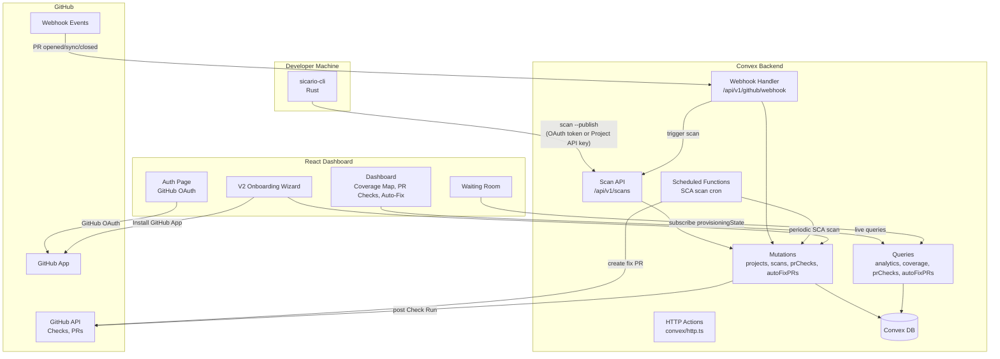
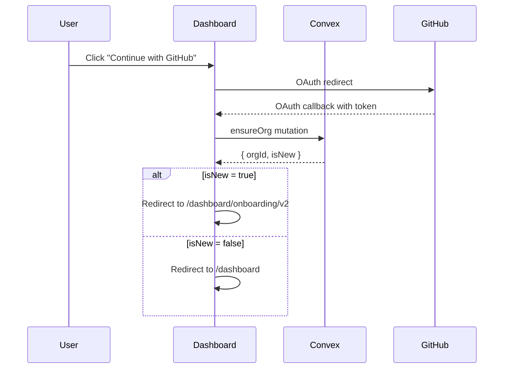
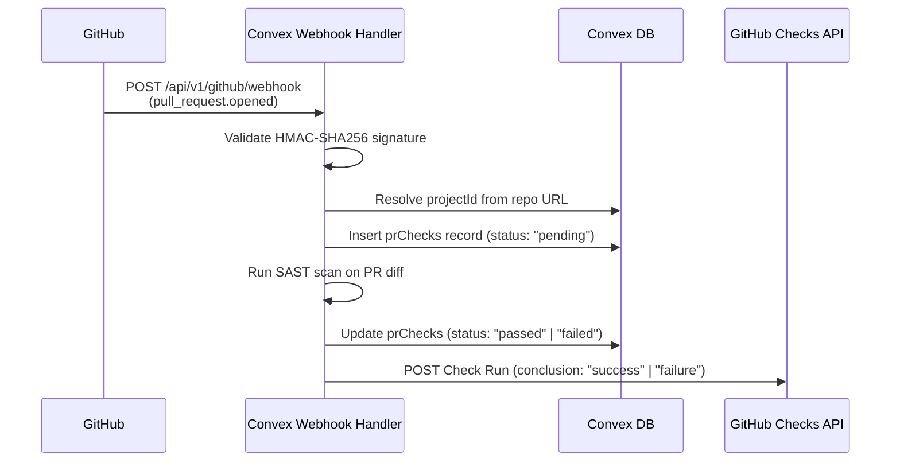
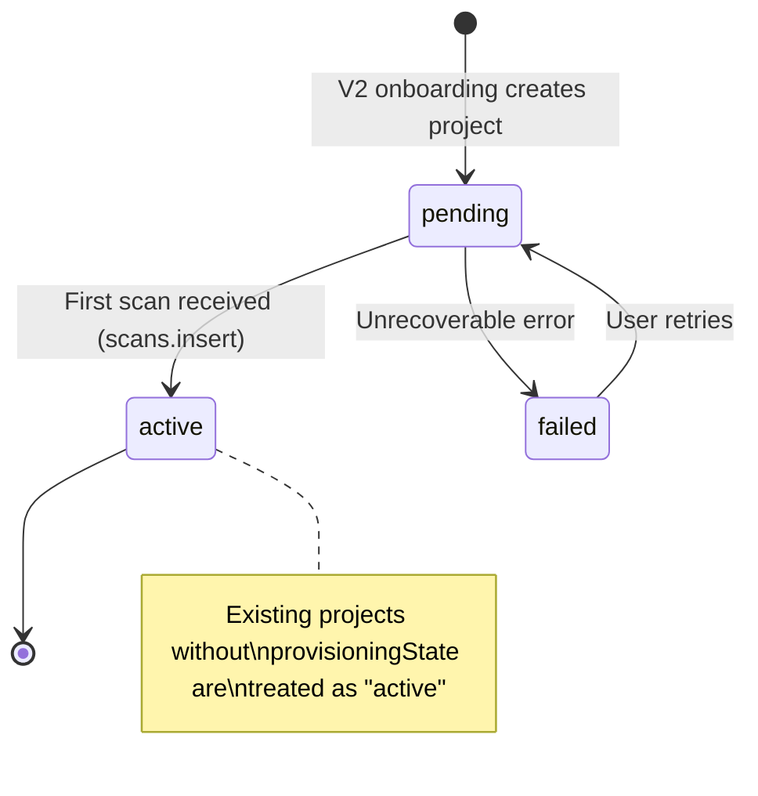

# Design Document: V2 Dashboard Architecture

## Overview

The V2 Dashboard Architecture transforms Sicario from a developer-focused CLI tool into an enterprise security platform. The design introduces four major capabilities on top of the existing Convex + React + Rust CLI stack:

1. **Zero-friction onboarding** — GitHub OAuth → invisible org provisioning → mandatory GitHub App authorization → Waiting Room with CLI install instructions → first scan triggers project activation.
2. **PR Security Check** — GitHub App webhook receives PR events, triggers cloud-side SAST scan on the diff, posts a GitHub Check Run that blocks merges when critical/high findings are detected.
3. **Autonomous Fix PRs** — Scheduled SCA scans detect CVEs in project dependencies and auto-open dependency bump PRs via the GitHub App API.
4. **Fleet-wide visibility** — Coverage Map shows protected vs. unprotected repos; PR Checks panel and Auto-Fix panel provide real-time status on the dashboard.

The design preserves full backward compatibility: existing `sicario scan . --publish` workflows, existing project records (no `provisioningState` field → treated as `"active"`), and existing CLI OAuth authentication all continue to work unchanged.

### Key Design Decisions

| Decision | Rationale |
|---|---|
| Extend existing `projects` table with optional fields instead of a new table | Avoids data duplication; existing queries continue to work since new fields are optional |
| HMAC-SHA256 webhook validation in Convex HTTP action | Convex HTTP actions can access `crypto.subtle` for HMAC; keeps all backend logic in one deployment |
| Project API key as a lightweight auth alternative | Enables CLI → Convex auth without full OAuth device flow; ideal for CI/CD and onboarding |
| `provisioningState` defaults to `"active"` at read-time for existing records | Zero-migration approach — existing projects without the field are treated as fully provisioned |
| Separate `prChecks` and `autoFixPRs` tables | Different lifecycles and query patterns; avoids polymorphic table design |

## Architecture

### System Data Flow



### Authentication Flow



### PR Security Check Flow



## Components and Interfaces

### Convex Backend Components

#### 1. GitHub Webhook Handler (`convex/convex/http.ts` — new route)

**Endpoint:** `POST /api/v1/github/webhook`

**Responsibilities:**
- Validate `X-Hub-Signature-256` header using HMAC-SHA256 with the GitHub App webhook secret
- Parse webhook event type from `X-GitHub-Event` header
- Route events: `pull_request.opened` / `pull_request.synchronize` → PR scan workflow; `pull_request.closed` (merged) → auto-fix PR status update
- Resolve `projectId` and `orgId` from the repository URL in the payload

**Interface:**
```typescript
// Request: GitHub webhook POST with headers
// X-Hub-Signature-256: sha256=<hex_digest>
// X-GitHub-Event: pull_request

// Response: 200 OK (acknowledged) | 401 Unauthorized (bad signature)
```

#### 2. PR Checks Module (`convex/convex/prChecks.ts` — new file)

```typescript
// Mutations
createPrCheck(args: {
  checkId: string, projectId: string, orgId: string,
  prNumber: number, prTitle: string, repositoryUrl: string
}): { checkId: string }

updatePrCheck(args: {
  checkId: string, status: "pending" | "passed" | "failed" | "blocked",
  findingsCount?: number, criticalCount?: number, highCount?: number,
  githubCheckRunId?: string
}): void

// Queries
listByOrg(args: { orgId: string }): PrCheck[]
listByProject(args: { projectId: string }): PrCheck[]
```

#### 3. Auto-Fix PRs Module (`convex/convex/autoFixPRs.ts` — new file)

```typescript
// Mutations
createAutoFix(args: {
  fixId: string, projectId: string, orgId: string,
  cveId: string, packageName: string, fromVersion: string, toVersion: string
}): { fixId: string }

updateAutoFixStatus(args: {
  fixId: string, status: "pending" | "opened" | "merged" | "closed" | "failed",
  prNumber?: number, prUrl?: string
}): void

// Queries
listByOrg(args: { orgId: string }): AutoFixPR[]
listByProject(args: { projectId: string }): AutoFixPR[]
hasDuplicateOpenFix(args: { projectId: string, cveId: string, packageName: string }): boolean
```

#### 4. Extended Projects Module (`convex/convex/projects.ts` — modified)

New mutations added to the existing module:

```typescript
// New: Create project from V2 onboarding with provisioning fields
createV2(args: {
  id: string, name: string, repositoryUrl: string, orgId: string,
  githubAppInstallationId: string, framework?: string
}): { id: string, projectApiKey: string }

// New: Transition provisioning state
transitionProvisioningState(args: {
  projectId: string, from: string, to: string
}): boolean

// New: Lookup by API key
getByApiKey(args: { projectApiKey: string }): Project | null
```

#### 5. Extended Scans Module (`convex/convex/scans.ts` — modified)

The existing `insert` mutation is extended to check `provisioningState` on the matched project and transition it from `"pending"` to `"active"` when the first scan arrives.

#### 6. Scheduled SCA Scan (`convex/convex/scheduledScans.ts` — new file)

A Convex scheduled function that runs every 24 hours (configurable), iterates over projects with `autoFixEnabled !== false`, runs SCA analysis, and creates auto-fix PR records + GitHub PRs for detected CVEs.

### React Frontend Components

#### 7. V2 Onboarding Wizard (`sicario-frontend/src/pages/dashboard/OnboardingV2Page.tsx`)

A multi-step wizard with three screens:
1. **Repo Connect** — GitHub App installation flow → repository selection → optional framework dropdown
2. **Waiting Room** — Terminal-style loading screen with CLI install command, project API key, and `sicario scan . --publish` command
3. **Redirect** — Auto-redirect to project dashboard when `provisioningState` becomes `"active"`

#### 8. Coverage Map (`sicario-frontend/src/components/dashboard/CoverageMap.tsx`)

Displays protected vs. unprotected repository ratio. Uses Convex live query on `projects` table filtered by `orgId`. Shows progress bar + counts. Empty state prompts repo connection.

#### 9. PR Checks Panel (`sicario-frontend/src/components/dashboard/PrChecksPanel.tsx`)

Real-time list of PR check results grouped by status (Passed, Failed, Pending). Each entry shows: repo name, PR number, PR title, status badge, findings count, GitHub PR link.

#### 10. Auto-Fix Panel (`sicario-frontend/src/components/dashboard/AutoFixPanel.tsx`)

Real-time list of auto-fix PRs showing: CVE ID, package name, version change (from → to), PR link, status badge.

#### 11. Trust Badge (`sicario-frontend/src/components/dashboard/TrustBadge.tsx`)

Shield icon + "Zero-Exfiltration: Telemetry Only" text in the sidebar footer. Hover/click shows a popover explaining local-only code processing.

### CLI Components

#### 12. Project API Key Auth (`sicario-cli/src/auth/token_store.rs` — extended)

New `store_project_api_key` / `get_project_api_key` / `clear_project_api_key` methods on `TokenStore`, mirroring the existing `cloud_token` pattern. Also checks `SICARIO_PROJECT_API_KEY` environment variable.

#### 13. Auth Priority Logic (`sicario-cli/src/auth/auth_module.rs` — extended)

New `resolve_auth_token()` method that returns the best available credential:
1. Cloud OAuth token (preferred)
2. Project API key (fallback)
3. Error with instructions to run `sicario login` or set `SICARIO_PROJECT_API_KEY`

When using a project API key, the `Authorization` header uses the scheme `Bearer project:{projectApiKey}`.

## Data Models

### Extended `projects` Table

New optional fields added to the existing `projects` table definition in `convex/convex/schema.ts`:

```typescript
projects: defineTable({
  // ... existing fields unchanged ...
  projectId: v.string(),
  name: v.string(),
  repositoryUrl: v.string(),
  description: v.string(),
  orgId: v.string(),
  teamId: v.optional(v.string()),
  createdAt: v.string(),

  // V2 extensions (all optional for backward compatibility)
  provisioningState: v.optional(v.string()),       // "pending" | "active" | "failed"
  githubAppInstallationId: v.optional(v.string()),
  framework: v.optional(v.string()),
  projectApiKey: v.optional(v.string()),
  severityThreshold: v.optional(v.string()),        // default: "high"
  autoFixEnabled: v.optional(v.boolean()),           // default: true
})
  .index("by_projectId", ["projectId"])
  .index("by_teamId", ["teamId"])
  .index("by_orgId", ["orgId"])
  .index("by_projectApiKey", ["projectApiKey"])      // NEW: for API key lookup
```

**Read-time defaults:** When `provisioningState` is `undefined`, treat as `"active"`. When `severityThreshold` is `undefined`, treat as `"high"`. When `autoFixEnabled` is `undefined`, treat as `true`.

### New `prChecks` Table

```typescript
prChecks: defineTable({
  checkId: v.string(),
  projectId: v.string(),
  orgId: v.string(),
  prNumber: v.number(),
  prTitle: v.string(),
  repositoryUrl: v.string(),
  status: v.string(),              // "pending" | "passed" | "failed" | "blocked"
  findingsCount: v.number(),
  criticalCount: v.number(),
  highCount: v.number(),
  githubCheckRunId: v.optional(v.string()),
  createdAt: v.string(),
  updatedAt: v.string(),
})
  .index("by_checkId", ["checkId"])
  .index("by_orgId", ["orgId"])
  .index("by_projectId", ["projectId"])
  .index("by_orgId_status", ["orgId", "status"])
```

### New `autoFixPRs` Table

```typescript
autoFixPRs: defineTable({
  fixId: v.string(),
  projectId: v.string(),
  orgId: v.string(),
  cveId: v.string(),
  packageName: v.string(),
  fromVersion: v.string(),
  toVersion: v.string(),
  prNumber: v.optional(v.number()),
  prUrl: v.optional(v.string()),
  status: v.string(),              // "pending" | "opened" | "merged" | "closed" | "failed"
  createdAt: v.string(),
})
  .index("by_fixId", ["fixId"])
  .index("by_orgId", ["orgId"])
  .index("by_projectId", ["projectId"])
  .index("by_projectId_cveId", ["projectId", "cveId"])
```

### Provisioning State Machine



**Transition rules:**
- `pending → active`: Triggered inside `scans.insert` mutation when `projectId` matches a project with `provisioningState === "pending"`
- `pending → failed`: Triggered by provisioning error handler
- `failed → pending`: Triggered by user retry action
- `active → pending`: **NOT ALLOWED** — enforced in `transitionProvisioningState` mutation

## React Route Structure

```
/auth                              → Auth.tsx (existing — unchanged)
/dashboard                         → DashboardLayout.tsx
  /dashboard/                      → OverviewPage.tsx (Coverage Map, PR Checks Panel, Auto-Fix Panel)
  /dashboard/projects              → ProjectsPage.tsx (existing — unchanged)
  /dashboard/projects/:projectId   → ProjectDetailPage.tsx (existing — unchanged)
  /dashboard/scans                 → ScansPage.tsx (existing — unchanged)
  /dashboard/scans/:scanId         → ScanDetailPage.tsx (existing — unchanged)
  /dashboard/findings              → FindingsPage.tsx (existing — unchanged)
  /dashboard/owasp                 → OwaspPage.tsx (existing — unchanged)
  /dashboard/settings              → SettingsPage.tsx (existing — unchanged)
  /dashboard/onboarding            → OnboardingPage.tsx (existing — unchanged)
  /dashboard/onboarding/v2         → OnboardingV2Page.tsx (NEW — V2 wizard)
```

All existing routes are preserved at their current paths. The V2 onboarding wizard is registered at a new sub-path to coexist with the existing onboarding during migration. The `DashboardLayout` wraps all `/dashboard/*` routes and includes the sidebar with the Trust Badge in the footer.

### Auth Guard

An `AuthGuard` wrapper component checks `useConvexAuth().isAuthenticated` and redirects unauthenticated users to `/auth`. This is applied to all `/dashboard/*` routes.

### Post-Login Routing Logic

After successful GitHub OAuth:
1. Call `ensureOrg` mutation
2. If `isNew === true` → redirect to `/dashboard/onboarding/v2`
3. If `isNew === false` → redirect to `/dashboard`

## Correctness Properties

*A property is a characteristic or behavior that should hold true across all valid executions of a system — essentially, a formal statement about what the system should do. Properties serve as the bridge between human-readable specifications and machine-verifiable correctness guarantees.*

### Property 1: Org provisioning creates correct org name and admin membership

*For any* valid GitHub display name, calling `ensureOrg` for a user with no existing membership SHALL create an organization named `"{displayName}'s Org"` and a membership with role `"admin"` for that user.

**Validates: Requirements 2.1, 2.2**

### Property 2: ensureOrg is idempotent for existing members

*For any* user who already has at least one organization membership, calling `ensureOrg` SHALL return `isNew: false` and SHALL NOT create any new organization or membership records.

**Validates: Requirements 2.5**

### Property 3: V2 project creation sets provisioning fields and generates unique API key

*For any* valid repository URL and GitHub App installation ID, creating a project via the V2 onboarding flow SHALL produce a project record with `provisioningState` equal to `"pending"`, the provided `githubAppInstallationId`, and a non-empty `projectApiKey` that is unique across all projects.

**Validates: Requirements 3.4, 3.6, 9.5, 13.1, 15.4**

### Property 4: HMAC-SHA256 webhook signature validation

*For any* webhook payload bytes and any secret string, computing `HMAC-SHA256(secret, payload)` and comparing against the `X-Hub-Signature-256` header SHALL accept the request when the signature matches and reject with HTTP 401 when it does not match.

**Validates: Requirements 6.1, 6.8, 10.2, 10.3**

### Property 5: PR check conclusion is determined by severity threshold

*For any* list of scan findings with varying severities and *for any* severity threshold, the PR check conclusion SHALL be `"failure"` if and only if at least one finding has severity at or above the threshold, and `"success"` otherwise.

**Validates: Requirements 6.4, 6.5**

### Property 6: Optional project fields resolve to correct defaults

*For any* project record, the effective `provisioningState` SHALL be the stored value if present or `"active"` if undefined; the effective `severityThreshold` SHALL be the stored value if present or `"high"` if undefined; the effective `autoFixEnabled` SHALL be the stored value if present or `true` if undefined.

**Validates: Requirements 6.7, 7.7, 15.2**

### Property 7: No duplicate auto-fix PRs for same CVE and package

*For any* project, CVE ID, and package name combination, if an `autoFixPRs` record with status `"opened"` or `"pending"` already exists, attempting to create another auto-fix PR for the same combination SHALL be rejected.

**Validates: Requirements 7.9**

### Property 8: Provisioning state machine transitions

*For any* project, the provisioning state machine SHALL enforce: (a) inserting a scan for a project with `provisioningState === "pending"` transitions it to `"active"`; (b) inserting a scan for a project with `provisioningState === "active"` or `undefined` does NOT modify the state; (c) transitioning from `"active"` to `"pending"` is rejected.

**Validates: Requirements 13.2, 13.4, 16.1, 16.2**

### Property 9: Project API key lookup resolves correct project and org

*For any* project with a `projectApiKey`, looking up the project by that API key SHALL return the correct `projectId` and `orgId` from the matched project record.

**Validates: Requirements 14.3, 17.5**

### Property 10: CLI auth token resolution priority

*For any* credential state, `resolve_auth_token` SHALL return the cloud OAuth token when it is available (regardless of whether a project API key also exists), SHALL return the project API key formatted as `"Bearer project:{key}"` when only a project API key is available, and SHALL return an error when neither credential is available.

**Validates: Requirements 14.5, 14.6, 17.1, 17.2, 17.3**

### Property 11: Token store round-trip for project API key

*For any* valid API key string, storing it via `store_project_api_key` and then retrieving it via `get_project_api_key` SHALL return the identical string.

**Validates: Requirements 14.1**

### Property 12: Webhook repo URL resolves to correct project

*For any* project with a `repositoryUrl`, a webhook payload containing that repository URL SHALL resolve to the correct `projectId` and `orgId`.

**Validates: Requirements 10.7**

### Property 13: Coverage count computation

*For any* set of projects belonging to an organization, the protected count SHALL equal the number of projects with effective `provisioningState` equal to `"active"`, and the unprotected count SHALL equal the total GitHub repos minus the protected count.

**Validates: Requirements 5.1**

## Error Handling

### Webhook Handler Errors

| Error Condition | Response | Action |
|---|---|---|
| Missing or invalid `X-Hub-Signature-256` | HTTP 401 | Log invalid signature attempt, discard payload |
| Unrecognized event type | HTTP 200 | Acknowledge and ignore |
| Repository URL not matching any project | HTTP 200 | Acknowledge and take no action |
| Internal scan failure | HTTP 500 | Log error, set prChecks status to `"failed"` |

### Provisioning Errors

| Error Condition | Behavior |
|---|---|
| `ensureOrg` mutation fails | Retry once; if retry fails, display error to user |
| Project creation fails | Set `provisioningState` to `"failed"`, display retry button in Waiting Room |
| Concurrent provisioning state update | Log conflict, proceed with scan insertion (scan data is not lost) |
| Project API key collision (extremely unlikely) | Regenerate key and retry insertion |

### CLI Auth Errors

| Error Condition | Behavior |
|---|---|
| No OAuth token and no project API key | Display error: "Run `sicario login` or set `SICARIO_PROJECT_API_KEY`" |
| Invalid project API key (no matching project) | Convex returns auth error; CLI displays "Invalid project API key" |
| Expired OAuth token | Attempt refresh via `refresh_token`; if refresh fails, prompt re-login |

### GitHub API Errors

| Error Condition | Behavior |
|---|---|
| Check Run creation fails | Log error, set prChecks status to `"failed"`, do not block PR |
| Auto-fix PR creation fails (insufficient permissions) | Record `autoFixPRs` status as `"failed"`, surface error on dashboard |
| GitHub API rate limit | Exponential backoff with retry; log rate limit event |

## Testing Strategy

### Unit Tests

Unit tests cover specific examples, edge cases, and integration points:

- **Webhook signature validation**: Test with known payload/secret/signature triples
- **Severity threshold comparison**: Test each severity level against each threshold
- **Provisioning state transitions**: Test each valid and invalid transition
- **Default field resolution**: Test projects with and without optional fields
- **Auth token resolution**: Test each credential combination (both, OAuth only, API key only, neither)
- **Project API key generation**: Test uniqueness and format
- **Coverage count computation**: Test with various project sets
- **Auto-fix duplicate detection**: Test with existing open PRs

### Property-Based Tests

Property-based tests verify universal properties across randomly generated inputs. Each test runs a minimum of 100 iterations.

**Library:** `fast-check` for TypeScript/Convex tests, `proptest` for Rust/CLI tests.

Each property test is tagged with:
```
Feature: v2-dashboard-architecture, Property {number}: {property_text}
```

**Convex-side properties (fast-check):**
- Property 1: Org provisioning name format and admin role
- Property 2: ensureOrg idempotency
- Property 3: V2 project creation fields and API key uniqueness
- Property 5: Severity threshold decision function
- Property 6: Default field resolution
- Property 7: Auto-fix duplicate prevention
- Property 8: Provisioning state machine transitions
- Property 9: Project API key lookup correctness
- Property 12: Webhook repo URL resolution
- Property 13: Coverage count computation

**CLI-side properties (proptest):**
- Property 4: HMAC-SHA256 validation (can also be tested in TypeScript)
- Property 10: Auth token resolution priority
- Property 11: Token store round-trip

### Integration Tests

Integration tests verify end-to-end workflows with mocked external services:

- **Onboarding flow**: OAuth → ensureOrg → GitHub App install → repo select → project creation → Waiting Room → scan → redirect
- **PR Security Check**: Webhook receipt → signature validation → scan → Check Run posting
- **Auto-fix PR**: Scheduled SCA scan → CVE detection → PR creation → merge webhook → status update
- **CLI publish**: `sicario scan . --publish` with OAuth token, with project API key, and with neither

### Smoke Tests

- Convex schema deploys successfully with new tables and fields
- Webhook endpoint is registered and reachable
- V2 onboarding route is accessible
- Existing routes remain functional
- Existing projects without new fields are queryable

