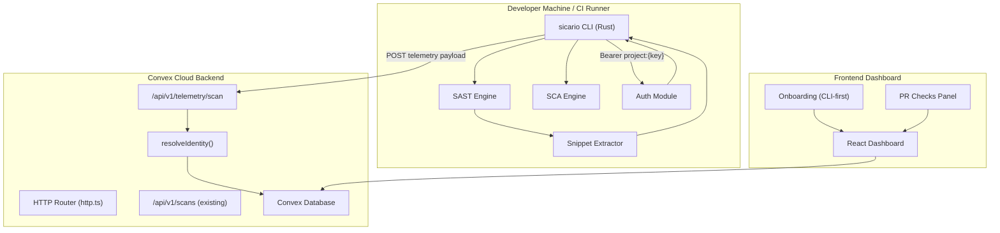

# Design Document: Zero-Exfiltration Edge Scanning

## Overview

This design pivots the Sicario platform from a cloud-side code-fetching model to a zero-exfiltration edge scanning architecture. All source code analysis happens locally on the developer's machine or CI runner via the Rust CLI. The Convex cloud backend becomes a telemetry ingestor and dashboard presentation layer — no source code ever leaves the developer's environment.

The work breaks into three streams:

1. **Deletion**: Remove all GitHub App webhook processing, PR scan workflow, cloud-side SAST engine, and associated authentication modules from the Convex backend.
2. **Telemetry Ingestion**: Build a new `POST /api/v1/telemetry/scan` HTTP endpoint that accepts structured scan findings from the CLI with strict validation.
3. **CLI Enhancement**: Update the Rust CLI with telemetry submission, snippet extraction with zero-exfiltration guarantees, project API key authentication, and CI/CD exit code gating.

### Design Rationale

The GitHub App model required source code to transit through the Convex cloud for scanning. This created a trust barrier for security-conscious teams. By moving all scanning to the edge (CLI), we eliminate that barrier entirely. The cloud backend only ever sees structured telemetry: rule IDs, severity levels, file paths, line numbers, and short truncated snippets.

## Architecture



### Key Architectural Decisions

1. **New endpoint vs. reusing `/api/v1/scans`**: A dedicated `/api/v1/telemetry/scan` endpoint is created rather than overloading the existing scans endpoint. The telemetry endpoint has stricter validation (snippet truncation, severity enum enforcement, findings count limits, duplicate scan rejection) and a flatter payload format optimized for CLI submission. The existing `/api/v1/scans` endpoint is retained for backward compatibility with the `--publish` flow.

2. **Snippet extraction at the CLI**: The CLI extracts and truncates snippets before transmission, enforcing the zero-exfiltration guarantee at the source. The backend also truncates as a defense-in-depth measure, but the CLI is the primary enforcement point.

3. **Auth priority chain**: The CLI resolves credentials in a 5-level priority chain to support both interactive development (OAuth) and headless CI (API key) without configuration friction.

## Components and Interfaces

### 1. Files to Delete (Convex Backend)

| File | Reason |
|------|--------|
| `convex/convex/prScanWorkflow.ts` | Cloud-side PR scan orchestrator — no longer needed |
| `convex/convex/prSastEngine.ts` | Cloud-side TypeScript SAST engine — replaced by CLI |
| `convex/convex/prSastRules.ts` | Cloud-side SAST rule definitions — replaced by CLI |
| `convex/convex/githubApp.ts` | Web Crypto GitHub App auth — no longer needed |
| `convex/convex/githubAppNode.ts` | Node.js GitHub App auth — no longer needed |
| `convex/convex/__tests__/pr-scan-workflow.test.ts` | Tests for deleted workflow |
| `convex/convex/__tests__/pr-scan-engine.test.ts` | Tests for deleted engine |
| `convex/convex/__tests__/pr-scan-rules.test.ts` | Tests for deleted rules |
| `convex/convex/__tests__/pr-scan-annotations.test.ts` | Tests for deleted annotations |
| `convex/convex/__tests__/pr-scan-fingerprint.test.ts` | Tests for deleted fingerprinting |
| `convex/convex/__tests__/pr-scan-threshold.test.ts` | Tests for deleted threshold logic |

### 2. Changes to `convex/convex/http.ts`

**Remove:**
- `POST /api/v1/github/webhook` route and its `OPTIONS` preflight
- `GET /api/v1/github/repos` route and its `OPTIONS` preflight
- `validateWebhookSignature()` helper function
- All inlined GitHub App utility functions: `ghBase64UrlEncode`, `ghBase64UrlEncodeString`, `requireGitHubAppEnv`, `generateAppJwt`, `getInstallationToken`, `listInstallationRepos`, `GH_REQUIRED_ENV_VARS`, `GH_API_HEADERS`

**Add:**
- `POST /api/v1/telemetry/scan` route (telemetry ingestion endpoint)
- `OPTIONS /api/v1/telemetry/scan` preflight route

**Retain:**
- `POST /api/v1/scans` (existing scan endpoint, backward compatible)
- `resolveIdentity()` (already supports JWT, `sic_` tokens, and `project:` API keys)
- `corsHeaders()`, `randomAlphanumeric()`, `sha256()`, `base64UrlEncode()`
- All OAuth device flow routes (`/oauth/device/code`, `/oauth/token`)
- All provider settings routes
- `GET /api/v1/whoami`

### 3. Telemetry Ingestion Endpoint (`POST /api/v1/telemetry/scan`)

```typescript
// Telemetry payload shape accepted by the endpoint
interface TelemetryPayload {
  projectId: string;        // Must match an existing project in the resolved org
  repositoryUrl: string;    // Repository URL for scan metadata
  commitSha: string;        // Git commit SHA
  scanId: string;           // Client-generated unique scan identifier
  branch?: string;          // Optional branch name
  prNumber?: number;        // Optional — triggers PR check creation/update
  durationMs?: number;      // Optional scan duration
  rulesLoaded?: number;     // Optional rules count
  filesScanned?: number;    // Optional files count
  findings: TelemetryFinding[];
}

interface TelemetryFinding {
  rule: string;             // Rule identifier (e.g. "sql-injection")
  severity: "Critical" | "High" | "Medium" | "Low";
  file: string;             // Relative file path
  line: number;             // 1-indexed line number
  snippet: string;          // Truncated to 100 chars by endpoint
  cweId?: string;           // Optional CWE identifier
  owaspCategory?: string;   // Optional OWASP category
  fingerprint?: string;     // Optional finding fingerprint
}
```

**Handler logic:**

1. Authenticate via `resolveIdentity(ctx, request)` → 401 if null
2. Parse JSON body
3. Validate required fields (`projectId`, `repositoryUrl`, `commitSha`, `scanId`, `findings`) → 400 if missing
4. Validate severity enum on each finding → 400 if invalid
5. Validate findings count ≤ 5000 → 400 if exceeded
6. Check for duplicate `scanId` in `scans` table → 409 if exists
7. Resolve org from identity (project API key auto-resolves; JWT/sic_ token uses membership lookup or `X-Sicario-Org` header)
8. Match `projectId` to existing project in resolved org → 404 if not found
9. Truncate each finding's `snippet` to 100 characters
10. Insert `scans` record with metadata
11. Insert one `findings` record per finding entry
12. If `prNumber` is present, create or update a `prChecks` record
13. Transition project from "pending" to "active" on first scan
14. Return 200 with `{ scan_id, project_id, dashboard_url }`

### 4. Schema Changes (`convex/convex/schema.ts`)

**Remove from `projects` table:**
- `githubAppInstallationId: v.optional(v.string())`

**Remove from `prChecks` table:**
- `githubCheckRunId: v.optional(v.string())`

All other tables, indexes, and fields remain unchanged.

### 5. CLI Snippet Extraction Module

New module: `sicario-cli/src/snippet/extractor.rs`

```rust
pub struct SnippetConfig {
    /// Number of context lines above and below the vulnerable line (default: 3)
    pub context_lines: usize,
    /// Maximum characters per line (default: 100)
    pub max_line_length: usize,
}

pub struct SnippetExtractor;

impl SnippetExtractor {
    /// Extract a snippet from the given file content around the target line.
    ///
    /// Returns the extracted snippet string, or an empty string if the line
    /// number is out of bounds.
    pub fn extract(
        content: &str,
        target_line: usize,  // 1-indexed
        config: &SnippetConfig,
    ) -> String;
}
```

**Algorithm:**
1. Split file content into lines
2. If `target_line` > total lines, return empty string and log warning
3. Compute window: `start = max(1, target_line - context_lines)`, `end = min(total_lines, target_line + context_lines)`
4. Extract lines `[start..=end]`
5. Truncate each line to `max_line_length` characters
6. Join with newlines
7. Final string length is guaranteed ≤ `(2 * context_lines + 1) * max_line_length`

**CLI flags:**
- `--snippet-context <N>` (default: 3, min: 0, max: 10)
- `SICARIO_SNIPPET_CONTEXT` environment variable (same constraints)

### 6. CLI Auth Resolution (Updated Priority Chain)

The `AuthModule::resolve_auth_token()` method is updated to implement the full 5-level priority chain:

```
Priority 1: SICARIO_API_KEY env var         → "Bearer project:{key}"
Priority 2: Cloud OAuth token from keychain → "Bearer {token}"
Priority 3: SICARIO_PROJECT_API_KEY env var → "Bearer project:{key}"
Priority 4: Project API key from keychain   → "Bearer project:{key}"
Priority 5: api_key field in .sicario/config.yaml → "Bearer project:{key}"
```

If none are available, exit with error: `"Run 'sicario login' or set SICARIO_API_KEY"`.

### 7. CLI Telemetry Submission

New module: `sicario-cli/src/publish/telemetry_client.rs`

```rust
pub struct TelemetryClient {
    base_url: String,
    auth_token: String,
    http: reqwest::blocking::Client,
}

impl TelemetryClient {
    pub fn new(base_url: String, auth_token: String) -> Result<Self>;

    /// Submit a telemetry payload to POST /api/v1/telemetry/scan.
    /// Returns Ok(TelemetryResponse) on 200, logs warnings on errors.
    pub fn submit(&self, payload: &TelemetryPayload) -> Result<TelemetryResponse>;
}

pub struct TelemetryPayload {
    pub project_id: String,
    pub repository_url: String,
    pub commit_sha: String,
    pub scan_id: String,
    pub branch: Option<String>,
    pub pr_number: Option<u32>,
    pub duration_ms: Option<u64>,
    pub rules_loaded: Option<usize>,
    pub files_scanned: Option<usize>,
    pub findings: Vec<TelemetryFinding>,
}

pub struct TelemetryFinding {
    pub rule: String,
    pub severity: String,  // "Critical" | "High" | "Medium" | "Low"
    pub file: String,
    pub line: usize,
    pub snippet: String,   // Pre-truncated by SnippetExtractor
    pub cwe_id: Option<String>,
    pub owasp_category: Option<String>,
    pub fingerprint: Option<String>,
}

pub struct TelemetryResponse {
    pub scan_id: String,
    pub project_id: String,
    pub dashboard_url: Option<String>,
}
```

### 8. CLI Exit Code / `--fail-on` Flag

The existing `ExitCode::from_findings()` already implements severity threshold gating. The changes are:

- Add `--fail-on` flag to `ScanArgs` (accepts `"Critical"`, `"High"`, `"Medium"`, `"Low"`, default: `"High"`)
- Add `SICARIO_FAIL_ON` env var support (flag takes precedence)
- Invalid values → exit code 2 (`InternalError`) with descriptive error
- In GitHub Actions (`GITHUB_ACTIONS` env var present), emit a summary annotation to stdout

The `--fail-on` flag replaces the existing `--severity-threshold` for CI gating purposes. `--severity-threshold` controls which findings are *displayed*; `--fail-on` controls the *exit code*.


## Data Models

### Telemetry Payload (CLI → Backend)

```json
{
  "projectId": "proj-abc123",
  "repositoryUrl": "https://github.com/org/repo",
  "commitSha": "a1b2c3d4e5f6",
  "scanId": "scan-1234567890-ABCDEF",
  "branch": "main",
  "prNumber": 42,
  "durationMs": 1500,
  "rulesLoaded": 25,
  "filesScanned": 100,
  "findings": [
    {
      "rule": "sql-injection",
      "severity": "High",
      "file": "src/db.py",
      "line": 42,
      "snippet": "cursor.execute(query)",
      "cweId": "CWE-89",
      "owaspCategory": "A03",
      "fingerprint": "abc123def456"
    }
  ]
}
```

### Telemetry Response (Backend → CLI)

```json
{
  "scan_id": "scan-1234567890-ABCDEF",
  "project_id": "proj-abc123",
  "dashboard_url": "https://usesicario.xyz/dashboard/scans/scan-1234567890-ABCDEF"
}
```

### Schema Changes Summary

| Table | Field | Action |
|-------|-------|--------|
| `projects` | `githubAppInstallationId` | Remove |
| `prChecks` | `githubCheckRunId` | Remove |

All other tables and fields remain unchanged. The `scans`, `findings`, and `prChecks` tables are reused by the telemetry endpoint with the same schema.

### CLI Rust Types

```rust
// New TelemetryPayload struct (sicario-cli/src/publish/telemetry_client.rs)
#[derive(Debug, Clone, Serialize, Deserialize, PartialEq)]
pub struct TelemetryPayload {
    #[serde(rename = "projectId")]
    pub project_id: String,
    #[serde(rename = "repositoryUrl")]
    pub repository_url: String,
    #[serde(rename = "commitSha")]
    pub commit_sha: String,
    #[serde(rename = "scanId")]
    pub scan_id: String,
    pub branch: Option<String>,
    #[serde(rename = "prNumber")]
    pub pr_number: Option<u32>,
    #[serde(rename = "durationMs")]
    pub duration_ms: Option<u64>,
    #[serde(rename = "rulesLoaded")]
    pub rules_loaded: Option<usize>,
    #[serde(rename = "filesScanned")]
    pub files_scanned: Option<usize>,
    pub findings: Vec<TelemetryFinding>,
}

#[derive(Debug, Clone, Serialize, Deserialize, PartialEq)]
pub struct TelemetryFinding {
    pub rule: String,
    pub severity: String,
    pub file: String,
    pub line: usize,
    pub snippet: String,
    #[serde(rename = "cweId", skip_serializing_if = "Option::is_none")]
    pub cwe_id: Option<String>,
    #[serde(rename = "owaspCategory", skip_serializing_if = "Option::is_none")]
    pub owasp_category: Option<String>,
    pub fingerprint: Option<String>,
}

// SnippetConfig (sicario-cli/src/snippet/extractor.rs)
pub struct SnippetConfig {
    pub context_lines: usize,   // default: 3, min: 0, max: 10
    pub max_line_length: usize, // default: 100
}
```

## Correctness Properties

*A property is a characteristic or behavior that should hold true across all valid executions of a system — essentially, a formal statement about what the system should do. Properties serve as the bridge between human-readable specifications and machine-verifiable correctness guarantees.*

### Property 1: Telemetry Payload Serialization Round-Trip

*For any* valid `TelemetryPayload` object (with valid severity values, non-negative line numbers, and snippet lengths ≤ 100 characters), serializing to JSON and then deserializing back SHALL produce an object equal to the original. This implies that the findings array length, all severity values, all snippet contents, and all metadata fields are preserved through the round-trip.

**Validates: Requirements 9.1, 9.2, 9.3, 9.4**

### Property 2: Snippet Line Truncation Invariant

*For any* source file content and *for any* target line number within the file, every line in the extracted snippet SHALL have a length of at most `max_line_length` (100) characters, regardless of the original line lengths in the source file.

**Validates: Requirements 15.2, 7.1**

### Property 3: Severity Enum Validation

*For any* string value, the telemetry payload severity validator SHALL accept the string if and only if it is exactly one of `"Critical"`, `"High"`, `"Medium"`, or `"Low"`. All other strings SHALL be rejected.

**Validates: Requirements 7.2**

### Property 4: Auth Priority Chain Resolution

*For any* combination of credential availability states (SICARIO_API_KEY set/unset, cloud OAuth token present/absent, SICARIO_PROJECT_API_KEY set/unset, keychain project key present/absent, config.yaml api_key present/absent), the auth resolver SHALL always select the highest-priority available credential according to the defined priority order, and format it as `"Bearer project:{key}"` for project API keys or `"Bearer {token}"` for OAuth tokens.

**Validates: Requirements 14.1, 14.2, 14.6**

### Property 5: Zero-Exfiltration Snippet Window Correctness

*For any* source file with uniquely identifiable lines and *for any* target line number and context window size (0–10), the extracted snippet SHALL contain only content from lines within the range `[max(1, target - context_lines), min(total_lines, target + context_lines)]` and SHALL NOT contain any content from lines outside that range.

**Validates: Requirements 15.1, 15.5**

### Property 6: Exit Code Threshold Correctness

*For any* list of findings (each with a severity and suppression state) and *for any* severity threshold, the exit code SHALL be `FindingsDetected` (1) if and only if at least one non-suppressed finding has severity greater than or equal to the threshold. Otherwise, the exit code SHALL be `Clean` (0).

**Validates: Requirements 16.1, 16.2, 16.7**

### Property 7: Telemetry Payload Required Field Validation

*For any* JSON object submitted to the telemetry endpoint, the validator SHALL reject the payload (return an error) if and only if one or more of the required fields (`projectId`, `repositoryUrl`, `commitSha`, `scanId`, `findings`) is missing or null. The error message SHALL identify which fields are missing.

**Validates: Requirements 6.4, 6.5**

## Error Handling

### Convex Backend (Telemetry Endpoint)

| Condition | HTTP Status | Response Body |
|-----------|-------------|---------------|
| No valid Bearer token | 401 | `{"error": "Unauthorized"}` |
| Missing required fields | 400 | `{"error": "Missing required fields: projectId, commitSha, ..."}` |
| Invalid severity value | 400 | `{"error": "Invalid severity 'X' in finding at index N. Must be Critical, High, Medium, or Low"}` |
| Findings count > 5000 | 400 | `{"error": "Payload contains N findings, maximum is 5000"}` |
| Duplicate scanId | 409 | `{"error": "Scan 'X' has already been submitted"}` |
| Project not found in org | 404 | `{"error": "Project 'X' not found in organization"}` |
| Not a member of org | 403 | `{"error": "Not a member of specified organization"}` |
| Internal error | 500 | `{"error": "<message>"}` |
| Success | 200 | `{"scan_id": "...", "project_id": "...", "dashboard_url": "..."}` |

### CLI Error Handling

| Condition | Behavior |
|-----------|----------|
| No credentials available | Exit with error: "Run `sicario login` or set `SICARIO_API_KEY`" |
| HTTP 401 from telemetry endpoint | Log error: "API key is invalid or expired. Regenerate in the Sicario dashboard." |
| HTTP 4xx/5xx from telemetry endpoint | Log warning with status code and error message, continue scan |
| Network error (timeout, DNS, etc.) | Log warning, continue scan |
| Invalid `--fail-on` value | Exit code 2 with: "Invalid severity 'X'. Valid values: Critical, High, Medium, Low" |
| Invalid `--snippet-context` value | Exit code 2 with: "Snippet context must be between 0 and 10" |
| Vulnerable line > file length | Empty snippet, log warning |

The CLI follows a "best-effort telemetry" philosophy: telemetry submission failures never cause the scan itself to fail. The scan result and exit code are always determined locally.

## Testing Strategy

### Property-Based Tests (Rust, using `proptest`)

Each correctness property maps to a single property-based test with a minimum of 100 iterations. Tests are tagged with the property they validate.

| Property | Test Location | Generator Strategy |
|----------|---------------|-------------------|
| P1: Serialization round-trip | `sicario-cli/src/publish/telemetry_property_tests.rs` | Generate random `TelemetryPayload` with valid severities, random strings for fields, random finding counts (0–100), snippets ≤ 100 chars |
| P2: Snippet truncation | `sicario-cli/src/snippet/snippet_property_tests.rs` | Generate random file contents with lines of 0–500 chars, random target lines, verify all output lines ≤ 100 chars |
| P3: Severity validation | `sicario-cli/src/publish/telemetry_property_tests.rs` | Generate arbitrary strings, verify acceptance iff string ∈ {"Critical", "High", "Medium", "Low"} |
| P4: Auth priority chain | `sicario-cli/src/auth/auth_property_tests.rs` | Generate random boolean vectors for credential availability, verify highest-priority credential is selected |
| P5: Zero-exfiltration window | `sicario-cli/src/snippet/snippet_property_tests.rs` | Generate files with unique line markers (e.g., `LINE_N`), random target lines and context sizes, verify no out-of-window markers appear in snippet |
| P6: Exit code threshold | `sicario-cli/src/cli/exit_code_property_tests.rs` | Generate random finding lists with random severities/suppression, random thresholds, verify exit code matches predicate |
| P7: Required field validation | `sicario-cli/src/publish/telemetry_property_tests.rs` | Generate random JSON objects with subsets of required fields removed, verify rejection iff any required field is missing |

### Unit Tests (Example-Based)

| Area | Test Cases |
|------|------------|
| Telemetry endpoint auth | Unauthenticated request → 401 |
| Telemetry endpoint duplicate | Same scanId twice → 409 |
| Telemetry endpoint PR check | Payload with prNumber → prChecks record created |
| Telemetry endpoint success | Valid payload → 200 with scan_id, project_id, dashboard_url |
| Snippet extractor edge cases | Line 0, line > file length, empty file, context_lines = 0 |
| `--fail-on` parsing | Valid values, invalid values, env var precedence |
| Auth fallback | Only config.yaml api_key available → used correctly |
| Auth 401 handling | Mock 401 → descriptive error message |

### Integration Tests

| Area | Test Cases |
|------|------------|
| End-to-end telemetry flow | CLI scan → serialize → submit → verify in database |
| PR check creation | Submit with prNumber → verify prChecks record |
| Project provisioning transition | First scan → project state "pending" → "active" |
| Org resolution | JWT auth → membership lookup → correct orgId |

### Smoke Tests (Deletion Verification)

| Check | Method |
|-------|--------|
| `prScanWorkflow.ts` deleted | File existence check |
| `prSastEngine.ts` deleted | File existence check |
| `prSastRules.ts` deleted | File existence check |
| `githubApp.ts` deleted | File existence check |
| `githubAppNode.ts` deleted | File existence check |
| PR scan test files deleted | File existence check |
| No GitHub App env var references | Grep across all Convex source files |
| `githubAppInstallationId` removed from schema | Schema inspection |
| `githubCheckRunId` removed from schema | Schema inspection |
| Webhook route removed from http.ts | Route inspection |
| GitHub repos route removed from http.ts | Route inspection |
| Inlined GitHub App utils removed from http.ts | Function name grep |
**Validates: Requirements 7.2**

### Property 4: Auth Priority Chain Resolution

*For any* combination of credential availability states (SICARIO_API_KEY set/unset, cloud OAuth token present/absent, SICARIO_PROJECT_API_KEY set/unset, keychain project key present/absent, config.yaml api_key present/absent), the auth resolver SHALL always select the highest-priority available credential according to the defined priority order, and format it as `"Bearer project:{key}"` for project API keys or `"Bearer {token}"` for OAuth tokens.

**Validates: Requirements 14.1, 14.2, 14.6**

### Property 5: Zero-Exfiltration Snippet Window Correctness

*For any* source file with uniquely identifiable lines and *for any* target line number and context window size (0–10), the extracted snippet SHALL contain only content from lines within the range `[max(1, target - context_lines), min(total_lines, target + context_lines)]` and SHALL NOT contain any content from lines outside that range.

**Validates: Requirements 15.1, 15.5**

### Property 6: Exit Code Threshold Correctness

*For any* list of findings (each with a severity and suppression state) and *for any* severity threshold, the exit code SHALL be `FindingsDetected` (1) if and only if at least one non-suppressed finding has severity greater than or equal to the threshold. Otherwise, the exit code SHALL be `Clean` (0).

**Validates: Requirements 16.1, 16.2, 16.7**

### Property 7: Telemetry Payload Required Field Validation

*For any* JSON object submitted to the telemetry endpoint, the validator SHALL reject the payload (return an error) if and only if one or more of the required fields (`projectId`, `repositoryUrl`, `commitSha`, `scanId`, `findings`) is missing or null. The error message SHALL identify which fields are missing.

**Validates: Requirements 6.4, 6.5**

---

# EPIC: Zero-Exfiltration Edge Engine & Deterministic Remediation

## Context & Architectural Pivot

Sicario is enforcing a strict "Zero-Exfiltration" and "Zero-Liability" boundary:
1. **Zero-Exfiltration:** The cloud backend must never fetch or store raw source code. All AST parsing happens locally.
2. **Zero-Liability (BYOK):** The cloud backend must never store third-party LLM API keys. All LLM authentication happens locally on the edge.
3. **Architectural Guardrails:** The Rust CLI will act as a local Model Context Protocol (MCP) server for safe AI auto-remediation, strictly preventing AI agents from executing destructive generic shell commands.
4. **Auditability:** The CLI will bundle its deterministic reasoning into the telemetry payload to prove its math in the cloud dashboard.

## Phase 1: Rust CLI Upgrades (The Edge Engine)

### 1. Edge BYOK Configuration

**Environment Priority:** Default to reading system environment variables (`ANTHROPIC_API_KEY`, `OPENAI_API_KEY`) for seamless CI/CD integration.

**Local Config Fallback:** Implement `sicario config set <KEY> <VALUE>` to write to a local, user-permission-restricted file (e.g., `~/.sicario/config.toml`).

**Sicario Telemetry Key:** Ensure the CLI uses the `SICARIO_API_KEY` environment variable strictly to authenticate HTTP POST requests to the Convex telemetry endpoint.

**Design:**
- Create a new `sicario-cli/src/config/` module for local config management
- Implement `ConfigStore` struct with methods for reading/writing to `~/.sicario/config.toml`
- Set file permissions to 0600 on Unix, read/write for owner only on Windows
- Implement fallback chain: env vars → local config → keychain
- Document the separation between telemetry auth (`SICARIO_API_KEY`) and LLM auth (env vars + local config)

### 2. Embedded MCP Server (Architectural Guardrails)

**Security Rule:** Do NOT expose generic shell execution.

**Expose Type-Safe Tools:**
- `get_ast_node(file_path, line_number)`: Returns only localized AST context
- `analyze_reachability(source_node, sink_node)`: Traces inter-procedural data flow
- `propose_safe_mutation(node_id, patched_syntax)`: Queues an AST-level code patch for developer review

**Design:**
- Create `sicario-cli/src/mcp/server.rs` with JSON-RPC message handling
- Implement `McpServer` struct with methods for each type-safe tool
- Add validation layer to reject any tool calls that would execute shell commands
- Add `sicario mcp` subcommand to start the server
- Write property test: No MCP tool can execute shell commands

### 3. Infinite Loop Prevention (The Runaway Cap)

**Implementation:** When executing `sicario fix`, implement a hard `--max-iterations` flag (defaulting to 3).

**Graceful Degradation:** If the local LLM agent fails to produce a syntactically valid and secure AST mutation within the iteration limit, log the failure to `.sicario/trace.log` and execute `exit 1`.

**Design:**
- Add `--max-iterations` flag to `FixArgs` in `sicario-cli/src/cli/fix.rs`
- Add `SICARIO_MAX_ITERATIONS` env var support
- Implement iteration counter in the remediation engine
- On iteration limit reached, log diagnostic info and exit 1

### 4. Execution Audit Trail Logging

**Implementation:** Capture execution steps internally and attach `executionTrace` array to the telemetry payload.

**Design:**
- Create `ExecutionTrace` struct in `sicario-cli/src/audit/trace.rs`
- Implement `TraceRecorder` that captures steps during analysis
- Add `executionTrace: Vec<String>` field to `TelemetryFinding` struct
- Include in JSON payload sent to `POST /api/v1/telemetry/scan`

## Phase 2: Convex Backend Upgrades (The Cloud Memory)

### 1. Deprecate Cloud BYOK & Webhooks

**Schema Cleanup:** Delete any table definitions, fields, or queries related to storing or retrieving third-party LLM keys.

**Remove GitHub Webhook:** Delete the `api/v1/github/webhook` endpoint entirely.

**API Auth:** Ensure the new telemetry ingestion endpoint (`POST /api/v1/telemetry/scan`) purely validates the `SICARIO_API_KEY` for authorization.

**Design:**
- Search for and remove any `llmApiKey`, `openaiKey`, `anthropicKey` fields from schema
- Verify `api/v1/github/webhook` endpoint is deleted (completed in Task 1)
- Verify `POST /api/v1/telemetry/scan` uses only `SICARIO_API_KEY` for auth

### 2. Enforce Snippet Truncation (Server-Side Exfiltration Block)

**Update:** Add strict server-side validation to the incoming `snippet` string. If `snippet.length > 500` characters, forcefully truncate it.

**Design:**
- Update `POST /api/v1/telemetry/scan` ingestion logic in `convex/http.ts`
- Truncate snippets to 500 characters before storage
- Log a warning when truncation occurs

### 3. Schema Updates for Audit Trail

**Modify:** `convex/schema.ts` to include `executionTrace: v.optional(v.array(v.string()))` inside the `findings` table structure.

**Update:** The ingestion mutation to correctly map and insert the incoming `executionTrace` arrays.

**Design:**
- Add `executionTrace: v.optional(v.array(v.string()))` to the `findings` table schema
- Update the telemetry ingestion mutation to map `executionTrace` from payload to database

## Phase 3: Dashboard Frontend Upgrades (The Command Center)

### 1. Remove Supply-Chain Risks (Read-Only Enforcement)

**Remove OAuth/GitHub App Installs:** Completely remove any UI components, API routes, or database schemas related to GitHub OAuth, GitHub App installation, or repository connection.

**Update Onboarding:** Project creation should exclusively generate a `SICARIO_API_KEY` and display CLI installation instructions.

**Clean Settings UI:** Remove the "LLM Providers" or "API Keys" input sections entirely from the dashboard.

**Remove Cloud Fix Buttons:** Remove any UI buttons that suggest the dashboard can push code or create PRs directly. Replace them with read-only text blocks.

**Design:**
- Remove GitHub OAuth and App installation UI from OnboardingV2Page
- Update project creation form to generate `SICARIO_API_KEY` only
- Remove "LLM Providers" or "API Keys" input sections from Settings
- Replace cloud fix buttons with read-only text: `sicario fix --id=<VULN_ID>`

### 2. Display the Audit Trail

**Implementation:** Navigate to the expanded view for individual "Findings". Underneath the `Snippet` display, implement a premium, luxury-minimalist terminal-style UI block titled "Execution Audit Trail".

**Design:**
- Create `ExecutionAuditTrail` component in `sicario-frontend/src/components/dashboard/ExecutionAuditTrail.tsx`
- Use a monospace font and terminal-style styling
- Map over the `executionTrace` array to display chronological steps
- Include timestamps and action descriptions

## Correctness Properties (New for Epic)

### Property 8: LLM Key Isolation

*For any* LLM API key configuration, the CLI SHALL never transmit LLM API keys to the Convex backend. LLM keys SHALL only be stored locally in `~/.sicario/config.toml` or in environment variables.

**Validates: Zero-Liability boundary**

### Property 9: MCP Tool Safety

*For any* MCP tool call received by the CLI, the MCP server SHALL NOT execute any generic shell commands. The MCP server SHALL only expose type-safe tools that operate on AST nodes.

**Validates: Architectural Guardrails**

### Property 10: Iteration Limit Enforcement

*For any* `sicario fix` execution, the CLI SHALL execute `exit 1` if the LLM fails to produce a valid AST mutation within the `--max-iterations` limit (default: 3).

**Validates: Runaway prevention**

### Property 11: Execution Trace Completeness

*For any* scan execution, the `executionTrace` array SHALL contain all deterministic steps taken by the CLI during analysis, from parsing to vulnerability detection.

**Validates: Auditability**

### Property 12: Backend Snippet Truncation

*For any* incoming telemetry payload, the Convex backend SHALL guarantee that all stored snippets have a length of 500 characters or fewer, regardless of the original snippet length in the payload.

**Validates: Zero-Exfiltration boundary**